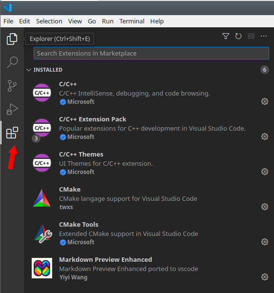

<!--
SPDX-FileCopyrightText: Copyright (C) 2023 B. Moessner
SPDX-License-Identifier: CC-BY-SA-4.0 or BSD-2-Clause
-->


# Xilinx ZYNQ7000

## Table of Contents
1. [Introduction](#introduction)

    1.1. [Supported Targets](#targets)

    1.2. [Target Comparison](#targetcomp)

    1.3. [Machine Setup](#machsetup)

2. [Hardware Setup](#hw)

    2.1. [Create a hardware platform, the FSBL and a boot image](#hw_xsa)

    2.2. [Test the boot image](#hw_boot) 

2. [Xilinx QEMU](#qemu)

    2.1. [Running `xilinx-zynq-a9` on QEMU (deprecated?)](#qemu_deprecated)

    2.2. [Running machines defined by a devicetree](#qemu_hardware)

    2.3. [Create a CMake based application](#cmake)

    * 2.3.1. [Build RTEMS and Libbsd](#cm_a)

    * 2.3.2. [Install VS Code and required extensions](#cm_b)

    * 2.3.3. [Create a CMake Toolchain File](#cm_c)


    2.4. [Debug applications running on QEMU](#qemu_software)

    2.2. [Debug applications running on target hardware](#hwsetup_debug)

4. [Appendix](#appendix)

  4.1. [`dts` folder](#dtsf)

  * 4.1.1 picozed-zynq7.dts

  * 4.1.2 zynq-7000.dtsi

  4.2. [`config` folder](#cfgf)

  * 4.2.1 `config.sh`

  4.3. [Scripts](#scripts)

  * 4.3.1 `1_3_0_install_tools.sh`

  * 4.3.2 `3_1_0_build_hardware.sh`

  * 4.3.3 `3_1_1_build_fsbl.sh`

  * 4.3.4 `3_1_2_build_boot_file.sh`


## 1 Introduction <a name="introduction"></a> 

This folder provides a minimal BSP (showcasing SMP and Console UART) for some of the most popular ZYNQ 7000 demo boards. In addition to that, the [Appendix](#appendix) contains some scripts and additional material to reproduce / follow this README. All work was done on Ubuntu 20.04.3 using Xilinx Vivado / Vitis / Vitis HLS 2021.2.1. If you require a more advanced method to program ZYNQ 7000 devices using OpenOCD, have a look at [this page](https://devel.rtems.org/wiki/Debugging/OpenOCD/Xilinx_Zynq).


### 1.1. Supported Targets <a name="targets"></a> 

| RTEMS BSP Name       | Compatible Board               | Product Page                                                                             |
| -------------------- | ------------------------------ | ---------------------------------------------------------------------------------------- |
| xilinx_zynq_zc702    | ZC702                          | https://www.xilinx.com/products/boards-and-kits/ek-z7-zc702-g.html                       |
| xilinx_zynq_zc706    | ZC706                          | https://www.xilinx.com/products/boards-and-kits/ek-z7-zc706-g.html                       |
| xilinx_zynq_zedboard | Zedboard                       | https://www.avnet.com/wps/portal/us/products/avnet-boards/avnet-board-families/zedboard/ |
| xilinx_zynq_picozed  | Picozed 7010, **7015**, 7020, 7030 | https://www.avnet.com/wps/portal/us/products/avnet-boards/avnet-board-families/picozed/  |
| xilinx_zynq_zybo     | **Zybo**                           | https://digilent.com/reference/programmable-logic/zybo/start                             |
| xilinx_zynq_zybo_z7  | Zybo **Z7-10**, Z7-20              | https://digilent.com/reference/programmable-logic/zybo-z7/start                          |
| xilinx_zynq_pynq     | **PYNQ Z1**, Z2                    | http://www.pynq.io/home.html |
| xilinx_zynq_microzed | MicroZed 7010, 7020                     | https://www.avnet.com/wps/portal/us/products/avnet-boards/avnet-board-families/microzed/ |                                                             |
| xilinx_zynq_a9_qemu  | **QEMU Machine xilinx-zynq-a9**    |                                                                                          |

**_NOTE:_** The author of this `README.md` has run RTEMS on the targets marked **bold**. Please update this README if you are using one of the boards that hasnt been marked yet.

**_NOTE:_** If you have an Arty Z7-10/20 you might want to compare schematic and xdc with PYNQ Z1. ;)


### 1.2. Target Comparison <a name="targetcomp"></a> 

<style>
tabled.horz {
    table-layout:fixed
}
table.horz td {
  text-align: center;
  vertical-align: middel;
  width:10%
}
table.horz th {
  text-align: right;
  background: grey;
  color: darkgrey;
  border-right: 1px solid darkgrey;
  border-bottom: 0px solid darkgrey; 
}
</style>

<table class="horz" style="width:100%">
    <tr.grey >
        <th>RTEMS BSP Name</th>
        <td>xilinx_zynq_zc702</td>
        <td>xilinx_zynq_zc706</td>
        <td>xilinx_zynq_zedboard</td>
        <td colspan="4" style="text-align: center">xilinx_zynq_picozed</td>
        <td>xilinx_zynq_zybo</td>
        <td colspan="2" style="text-align: center">xilinx_zynq_zybo_z7</td>
        <td colspan="2" style="text-align: center">xilinx_zynq_microzed</td>
        <td colspan="2" style="text-align: center">xilinx_zynq_pynq</td>
    </tr>
    <tr>
        <th>Compatible Board</th>
        <td>ZC702</td>
        <td>ZC706</td>
        <td>Zedboard</td>
        <td>PicoZed 7010 SOM C/I Grade</td>
        <td>PicoZed 7020 SOM C/I Grade</td>
        <td>PicoZed 7015 SOM I Grade</td>
        <td>PicoZed 7030 SOM I Grade</td>
        <td>Zybo</td>
        <td>Zybo Z7-10</td>
        <td>Zybo Z7-20</td>
        <td>MicoZed 7010 SOM C/I Grade</td>
        <td>MicoZed 7020 SOM C/I Grade</td>
        <td>PYNQ Z1</td>
        <td>PYNQ Z2</td>
    </tr>
    <tr>
        <th>Carrier</th>
        <td>NA</td>
        <td>NA</td>
        <td>NA</td>
        <td colspan="4" style="text-align: center">AES-PZCC-FMC-V2-G</td>
        <td>NA</td>
        <td>NA</td>
        <td>NA</td>
        <td colspan="2" style="text-align: center">various</td>
        <td>NA</td>
        <td>NA</td>
    </tr>
    <tr>
        <th>Part</th>
        <td>XC7Z020-1CLG484C</td>
        <td>XC7Z045-2FFG900C</td>
        <td>XC7Z020-1CLG484C</td>
        <td>XC7Z010-1CLG400C/I</td>
        <td>XC7Z020-1CLG400C/I</td>
        <td>XC7Z015-1SBG485I</td>
        <td>XC7Z030-1SBG485I</td>
        <td>XC7Z010-1CLG400C</td>
        <td>XC7Z010-1CLG400C</td>
        <td>XC7Z020-1CLG400C</td>
        <td>XC7Z010-1CLG400C</td>
        <td>XC7Z020-1CLG400C</td>
        <td>XC7Z020-1CLG400C</td>
        <td>XC7Z020-1CLG400C</td>
    </tr>
    <tr>
        <th>SD Card</th>
        <td colspan="14" style="text-align: center">Yes</td>
    </tr>
    <tr>
        <th>PS QSPI Flash</th>
        <td>2x16 MB</td>
        <td>16 MB</td>
        <td>32 MB</td>
        <td colspan="4" style="text-align: center">16 MB</td>
        <td>16 MB</td>
        <td colspan="2" style="text-align: center">16 MB</td>
        <td colspan="2" style="text-align: center">16 MB</td>
        <td colspan="2" style="text-align: center">16 MB</td>
    </tr>
    <tr>
        <th>PS DDR3</th>
        <td>1 GB</td>
        <td>1 GB</td>
        <td>512 MB</td>
        <td colspan="4" style="text-align: center">1 GB</td>
        <td>512 MB</td>
        <td colspan="2" style="text-align: center">1 GB</td>
        <td colspan="2" style="text-align: center">1 GB</td>
        <td colspan="2" style="text-align: center">512 MB</td>
    </tr>
    <tr>
        <th>PS Clk</th>
        <td>33.33 MHz</td>
        <td>33.33 MHz</td>
        <td>33.33 MHz</td>
        <td colspan="4" style="text-align: center">33.33 MHz</td>
        <td>50 MHz</td>
        <td colspan="2" style="text-align: center">33.33 MHz</td>
        <td colspan="2" style="text-align: center">33.33 MHz</td>
        <td colspan="2" style="text-align: center">50 MHz</td>
    </tr>
    <tr>
        <th>Console UART</th>
        <td  colspan="10" style="text-align: center">1</td>
        <td  colspan="2" style="text-align: center">0</td>
        <td  colspan="2" style="text-align: center">1</td>
    </tr>
</table>

### 1.3. Machine Setup <a name="machinesetup"></a> 

On Ubuntu 20.04, prepare the machine using:

```
sudo apt install build-essential unzip pax bison flex texinfo \
python3-dev python-is-python3 libpython2-dev libncurses5-dev zlib1g-dev \
ninja-build pkg-config libtool libpixman-1-dev default-jre  libhidapi-dev libftdi-dev libusb-1.0-0 libusb-1.0-0-dev

sudo snap install cmake
```

In addition to that, install: 

* [Xilinx 2021.2 Vivado / Vitis tools](https://www.xilinx.com/support/download/index.html/content/xilinx/en/downloadNav/vivado-design-tools/archive.html) 
* [VS Code](https://code.visualstudio.com/) or Eclipse Embedded (commented out in `1_3_0_install_tools.sh`)
* [Segger J-Link Software](https://www.segger.com/downloads/jlink/) if you plan to use J-Link 
* [Xilinx Cable Drivers](https://docs.xilinx.com/r/en-US/ug973-vivado-release-notes-install-license/Install-Cable-Drivers) if you want to use OpenOCD

The [Appendix](#appendix) contains a couple of scripts to easen the build flow. The expected folder structure in `~/demo` is:

```
.
├── app
│   ├── cmake
│   │   ├── rtems.spec.in
│   │   └── toolchain.cmake.in
│   ├── dbg
│   │   └── pynq.cfg
│   └── src
│       ├── CMakeLists.txt
│       └── main
│           ├── main.cpp
│           └── pre_main.c
├── dts
│   ├── picozed-zynq7.dtb
│   ├── picozed-zynq7.dts
│   └── zynq-7000.dtsi
├── LICENSE
├── README.md
├── scripts
│   ├── 1_3_0_install_tools.sh
│   ├── 2_1_0_build_hardware.sh
│   ├── 2_1_1_build_fsbl.sh
│   ├── 2_1_2_build_boot_file.sh
│   ├── 3_0_0_build_rtems_libbsd.sh
│   ├── 4_0_0_create_toolchain_file.sh
│   └── config
│       └── config.sh
└── vscode_extensions.png

```
Per default, the scripts will download & install all tools below `~/quick-start` (adjust this behaviour in `config.sh` if required). 

To build & install QEMU, OpenOCD, and the RTEMS tools, run:

```
blofeld@ubuntu::~/rtems_zynq_demo$ ./scripts/1_3_0_install_tools.sh 
```

## 2. Hardware Setup <a name="hw"></a> 

### 2.1. Create a hardware platform, the FSBL and a boot image <a name="hw_xsa"></a> 

RTEMS applications can be booted solely with the help of Xilinx Bootgen (i.e. Uboot is not necessarily required). Xilinx Bootgen creates a `boot.bin` file which contains the firststage bootloader (**FSBL**), the FPGA bitstream, and optionally an application. If the application is not included in the `boot.bin` file, the FSBL will enable the JTAG interface and halt operation after the FPGA is programmed. We will exploit this behaviour as downloading FSBL and Bitstream to the target device is time consuming. In addition to that, the debug scripts get more complex.

Bootgen takes in a `bif` - file which usually looks this way:

```
the_ROM_image:
{
  [bootloader] fsbl.elf
  bitstream.bit
  app.elf
}
```

To create a boot image simply run:
```
# SD Card boot.bin
bootgen -arch zynq -image my.bif -w on -o boot.bin

# Some programmers expect mcs
bootgen -arch zynq -image my.bi -w on -o boot.mcs
```

The reference design, firststage bootloader (**FSBL**) and boot image (**boot.bin / boot.mcs**) can be created with:

```
blofeld@ubuntu:~/demo$ ./2_1_0_build_hardware.sh -b <board_name>
```

The `board_name` can be one of:
* Pynq-Z1, -Z2
* Picozed-7010, -7015, -7020, -7030
* Microzed-7010, -7020
* Zybo, -Z7-10, -Z7-20

The **.xsa**, **.bin**, **.bit** , **.mcs** files for the board will be stored in `${TOP_INSTALL_DIR}/hw/<board_name>` (`${TOP_INSTALL_DIR}` can be set in `config.sh`). Internally, the script will call
```
2_1_1_build_fsbl -x <full_path_to_xsa_file> -b <bit_file_name> -o <full_path_to_output_folder>
```
to generate the bootloader and 
```
2_1_2_build_boot_file -b <bit_file> -f <fsbl_file> -o <full_path_to_output_folder>
```
to create a boot image which only contains the bitstream and the bootloader. If you want to include your application in the boot image, you can can call `3_1_2_build_boot_file` using `-a <app_file>`. 

```
2_1_2_build_boot_file -b <bit_file> -f <fsbl_file> -a <app_file> -o <full_path_to_output_folder>
```


### 2.2. Test the boot image <a name="hw_boot"></a> 

Copy the `boot.bin` to an SD card and plug it into your board. Switch the board to SD card boot mode and connect a terminal to the USB UART (115k2, 8N1). When you reset the board you should observe some messages from the FSBL telling you that it first programs the FPGA and then opens up the JTAG port before it halts.

Example of an FSBL boot log:

```
Xilinx First Stage Boot Loader Release 2021.2 Nov  1 2023-20:58:14
Devcfg driver initialized 
Silicon Version 3.1
Boot mode is SD
SD: rc= 0SD Init Done 
Flash Base Address: 0xE0100000
Reboot status register: 0x60600000
Multiboot Register: 0x0000C000
Image Start Address: 0x00000000
Partition Header Offset:0x00000C80
Partition Count: 2
Partition Number: 1
Header Dump
Image Word Len: 0x000F6EC0
Data Word Len: 0x000F6EC0
Partition Word Len:0x000F6EC0
Load Addr: 0x00000000
Exec Addr: 0x00000000
Partition Start: 0x000065D0
Partition Attr: 0x00000020
Partition Checksum Offset: 0x00000000
Section Count: 0x00000001
Checksum: 0xFFD14B7E
Bitstream
In FsblHookBeforeBitstreamDload function 
PCAP:StatusReg = 0x40000A30
PCAP:device ready
PCAP:Clear done
Level Shifter Value = 0xA 
Devcfg Status register = 0x40000A30 
PCAP:Fabric is Initialized done
PCAP register dump:
PCAP CTRL 0xF8007000: 0x4C00E07F
PCAP LOCK 0xF8007004: 0x0000001A
PCAP CONFIG 0xF8007008: 0x00000508
PCAP ISR 0xF800700C: 0x0802000B
PCAP IMR 0xF8007010: 0xFFFFFFFF
PCAP STATUS 0xF8007014: 0x00006A30
PCAP DMA SRC ADDR 0xF8007018: 0x00100001
PCAP DMA DEST ADDR 0xF800701C: 0xFFFFFFFF
PCAP DMA SRC LEN 0xF8007020: 0x000F6EC0
PCAP DMA DEST LEN 0xF8007024: 0x000F6EC0
PCAP ROM SHADOW CTRL 0xF8007028: 0xFFFFFFFF
PCAP MBOOT 0xF800702C: 0x0000C000
PCAP SW ID 0xF8007030: 0x00000000
PCAP UNLOCK 0xF8007034: 0x757BDF0D
PCAP MCTRL 0xF8007080: 0x30800100
DMA Done !
FPGA Done ! In FsblHookAfterBitstreamDload function 
Handoff Address: 0x00000000
In FsblHookBeforeHandoff function 
No Execution Address JTAG handoff 
```

## 3. Create a CMake based application <a name="cmake"></a> 

### 3.1. Build RTEMS and Libbsd <a name="cm_a"></a> 

Build and install RTEMS / libbsd by running the following script:


```
# Showcase OpenOCD debug session
blofeld@ubuntu:~/demo$ ./3_1_0_build_rtems_libbsd.sh -b xillinx_zynq_pynq

# Showcase QEMU and Segger J-Link debug session
blofeld@ubuntu:~/demo$ ./3_1_0_build_rtems_libbsd.sh -b xillinx_zynq_picozed
```

### 3.2. Create a CMake Toolchain File <a name="cm_b"></a> 

There are a few approaches to RTEMS + CMake. For example:

* See https://github.com/nasa/PSP/blob/main/cmake/Modules/Platform/RTEMS.cmake for extending CMake
* See https://github.com/robamu-org/rtems-cmake to extend RTEMS with modern CMake

Both of them have their pro/con and could even be combined. However, 

* a [CMake Toolchainfile](https://cmake.org/cmake/help/book/mastering-cmake/chapter/Cross%20Compiling%20With%20CMake.html) is required in either way 
* having modern CMake mechanisms availale only pays off if the CMakeLists of the libraries one puts on top of libbsd can be modified (not the case on my side)

This demo will use only use a toolchain file, which can be generated by running:

```
# Showcase OpenOCD debug session
blofeld@ubuntu:~/demo$ ./3_2_1_create_toolchain_file.sh -b xillinx_zynq_pynq

# Showcase QEMU and Segger J-Link debug session
blofeld@ubuntu:~/demo$ ./3_2_1_create_toolchain_file.sh -b xillinx_zynq_picozed
```


### 3.2. Install VS Code and required extensions <a name="cm_b"></a> 

VS Code can be installed from [here](https://code.visualstudio.com/download). Start VS Code and install the following extensions:




## 2. Xilinx QEMU <a name="qemu"></a> 


### 2.1. Running `xilinx-zynq-a9` on QEMU (deprecated?) <a name="qemu_deprecated"></a> 

The machine `xilinx-zynq-a9` is only a single core without caches. It seems to have become deprecated as no Xilinx documentation is mentioning it anymore. However, one can still run ticker as it was described in the previous README in this folder:

```
~/quick-start/install/qemu/bin/qemu-system-aarch64 -no-reboot -serial null -serial mon:stdio -net none \
-nographic -M xilinx-zynq-a9 -m 256M -kernel ticker.exe

qemu-system-arm: warning: nic cadence_gem.0 has no peer
qemu-system-arm: warning: nic cadence_gem.1 has no peer


*** BEGIN OF TEST CLOCK TICK ***
*** TEST VERSION: 6.0.0.bc8e39f8ac4bebd97388522e38978b7382dc74a7
*** TEST STATE: EXPECTED_PASS
*** TEST BUILD: RTEMS_POSIX_API
*** TEST TOOLS: 12.3.1 20231012 (RTEMS 6, RSB 633023de6517998ee3b84e7ed172b1c5f2bf502b, Newlib fbc5496)
TA1  - rtems_clock_get_tod - 09:00:00   12/31/1988
TA2  - rtems_clock_get_tod - 09:00:00   12/31/1988
TA3  - rtems_clock_get_tod - 09:00:00   12/31/1988
TA1  - rtems_clock_get_tod - 09:00:04   12/31/1988
TA2  - rtems_clock_get_tod - 09:00:09   12/31/1988
TA1  - rtems_clock_get_tod - 09:00:09   12/31/1988
TA3  - rtems_clock_get_tod - 09:00:14   12/31/1988
TA1  - rtems_clock_get_tod - 09:00:14   12/31/1988
TA2  - rtems_clock_get_tod - 09:00:19   12/31/1988
TA1  - rtems_clock_get_tod - 09:00:19   12/31/1988
TA1  - rtems_clock_get_tod - 09:00:24   12/31/1988
TA3  - rtems_clock_get_tod - 09:00:29   12/31/1988
TA2  - rtems_clock_get_tod - 09:00:29   12/31/1988
TA1  - rtems_clock_get_tod - 09:00:29   12/31/1988
TA1  - rtems_clock_get_tod - 09:00:34   12/31/1988

*** END OF TEST CLOCK TICK ***


[ RTEMS shutdown ]
RTEMS version: 6.0.0.bc8e39f8ac4bebd97388522e38978b7382dc74a7
RTEMS tools: 12.3.1 20231012 (RTEMS 6, RSB 633023de6517998ee3b84e7ed172b1c5f2bf502b, Newlib fbc5496)
executing thread ID: 0x0a010003
executing thread name: TA2 
```
**_NOTE:_** To shutdown a QEMU machine use `CTRL + A`, release the keys and hit `X`.

### 2.2. Running machines defined by a devicetree <a name="qemu_hardware"></a> 

Xilinx proposes to use the machine `arm-generic-fdt-7series` ([LINK](https://xilinx-wiki.atlassian.net/wiki/spaces/A/pages/821854273/Running+Bare+Metal+Applications+on+QEMU#RunningBareMetalApplicationsonQEMU-Runningabare-metalapplicationonZynq7000)). This virtual machine is described by a devicetree which can be used to model the hardware of a concrete board. 

A devicetree example for the Picozed board has been added (see subfolder `dts`). Some notes on that:
* The skelton `zynq-7000.dtsi` has been modified to make QEMU load a model of the PL310 cache controller. It may sound strange, but `compatible = "arm,pl310-cache";` must be replaced by `compatible = "arm,l2x0";` as the original setting only loads a dummy and you will end up with a fatal error (`ARM_FATAL_L2C_310_UNEXPECTED_ID`) as soon as RTEMS has been configured to use I/D caches.
* The devicetree specifies two cores. Therefore, `RTEMS_SMP` needs to be enabled when building RTEMS


The devicetree blob can be build using:

```
blofeld@ubuntu:~/demo$ mkdir ~/quick-start/install/dtb
blofeld@ubuntu:~/demo$ ~/quick-start/install/toolchain/bin/dtc  -I dts -O dtb -o ~/quick-start/install/dtb/picozed-zynq7.dtb dts/picozed-zynq7.dts
```

Now run the machine with:
```
~/qemu_install/bin/qemu-system-aarch64 -M arm-generic-fdt-7series -serial /dev/null -serial mon:stdio -display none \
-m 1024M -kernel ticker.exe -dtb ~/quick-start/install/dtb/picozed-zynq7.dtb


*** BEGIN OF TEST CLOCK TICK ***
*** TEST VERSION: 6.0.0.bc8e39f8ac4bebd97388522e38978b7382dc74a7
*** TEST STATE: EXPECTED_PASS
*** TEST BUILD: RTEMS_POSIX_API RTEMS_SMP
*** TEST TOOLS: 12.3.1 20231012 (RTEMS 6, RSB 633023de6517998ee3b84e7ed172b1c5f2bf502b, Newlib fbc5496)
TA1  - rtems_clock_get_tod - 09:00:00   12/31/1988
TA2  - rtems_clock_get_tod - 09:00:00   12/31/1988
TA3  - rtems_clock_get_tod - 09:00:00   12/31/1988
TA1  - rtems_clock_get_tod - 09:00:04   12/31/1988
TA2  - rtems_clock_get_tod - 09:00:09   12/31/1988
TA1  - rtems_clock_get_tod - 09:00:09   12/31/1988
TA3  - rtems_clock_get_tod - 09:00:14   12/31/1988
TA1  - rtems_clock_get_tod - 09:00:14   12/31/1988
TA2  - rtems_clock_get_tod - 09:00:19   12/31/1988
TA1  - rtems_clock_get_tod - 09:00:19   12/31/1988
TA1  - rtems_clock_get_tod - 09:00:24   12/31/1988
TA3  - rtems_clock_get_tod - 09:00:29   12/31/1988
TA2  - rtems_clock_get_tod - 09:00:29   12/31/1988
TA1  - rtems_clock_get_tod - 09:00:29   12/31/1988
TA1  - rtems_clock_get_tod - 09:00:34   12/31/1988

*** END OF TEST CLOCK TICK ***


[ RTEMS shutdown ]
CPU: 0
RTEMS version: 6.0.0.bc8e39f8ac4bebd97388522e38978b7382dc74a7
RTEMS tools: 12.3.1 20231012 (RTEMS 6, RSB 633023de6517998ee3b84e7ed172b1c5f2bf502b, Newlib fbc5496)
executing thread ID: 0x0a010003
executing thread name: TA2 
```
**_NOTE:_** To shutdown a QEMU machine use `CTRL + A`, release the keys and hit `X`.


#### 2.3.4. Setup VS Code for CMake <a name="cm_c"></a> 

Open the `app` folder in VS Code and create a folder called `.vscode`. Put the following three files in it and adjust the paths according to your needs:

1. `cmake-kits.json`

```
[{"name": "RTEMS", "toolchainFile": "/home/blofeld/quick-start/install/cmake/toolchain.cmake"}]
```

2. `settings.json`

```
{
  "cmake.generator": "Ninja",
  "cmake.sourceDirectory": "/home/blofeld/demo/app/src",
  "cmake.buildDirectory": "/home/blofeld/demo/app/build"
}
```


```
blofeld@ubuntu:~/demo$ ~/quick-start/install/qemu/bin/qemu-system-aarch64 -M arm-generic-fdt-7series \
-serial /dev/null -serial mon:stdio -display none \
-m 1024M -dtb ~/quick-start/install/dtb/picozed-zynq7.dtb -s -S
```
**_NOTE:_** `-S` freezes the target at startup
**_NOTE:_** `-s` opens a GDB server at port 1234

## 3. Hardware <a name="hw"></a> 

## 3.1. Create the hardware platform and bootimage <a name="hw_xsa"></a> 

To create the reference design (**XSA**), the firststage bootloader (**FSBL**) and boot image (**boot.bin / boot.mcs**) and store it in `${TOP_INSTALL_DIR}/hw/<board_name>` (`${TOP_INSTALL_DIR}` can be set in `config.sh`), run:


```
blofeld@ubuntu:~/demo$ ./3_1_0_build_hardware.sh -b <board_name>
```

The `board_name` can be one of:

* Pynq-Z1
* Pynq-Z2
* Picozed-7010
* Picozed-7015
* Picozed-7020
* Picozed-7030
* Microzed-7010
* Microzed-7020
* Zybo
* Zybo-Z7-10
* Zybo-Z7-20


Internally, the script will call
```
3_1_1_build_fsbl -x <full_path_to_xsa_file> -b <bit_file_name> -o <full_path_to_output_folder>
```
to generate the bootloader and 
```
3_1_2_build_boot_file -b <bit_file> -f <fsbl_file> -o <full_path_to_output_folder>
```
to create a boot image which only contains the bitstream and the bootloader. 

## 3.2. Boot a demo board <a name="hw_xsa"></a> 

Copy the `boot.bin` to an sd card and plug it into your board. Switch the board to sd card boot mode and connect a terminal to the USB UART (115k2, 8N1). When you reset the board you should observe some messages from the FSBL telling you that it first programs the FPGA and then opens up the JTAG port before it halts => Ready for debugging. You can also request the FSBL to load your application by including it in the `boot.bin` using `-a <app_file>`. 

```
3_1_2_build_boot_file -b <bit_file> -f <fsbl_file> -a <app_file> -o <full_path_to_output_folder>
```

Example of an FSBL boot log:

```
Xilinx First Stage Boot Loader Release 2021.2 Nov  1 2023-20:58:14
Devcfg driver initialized 
Silicon Version 3.1
Boot mode is SD
SD: rc= 0SD Init Done 
Flash Base Address: 0xE0100000
Reboot status register: 0x60600000
Multiboot Register: 0x0000C000
Image Start Address: 0x00000000
Partition Header Offset:0x00000C80
Partition Count: 2
Partition Number: 1
Header Dump
Image Word Len: 0x000F6EC0
Data Word Len: 0x000F6EC0
Partition Word Len:0x000F6EC0
Load Addr: 0x00000000
Exec Addr: 0x00000000
Partition Start: 0x000065D0
Partition Attr: 0x00000020
Partition Checksum Offset: 0x00000000
Section Count: 0x00000001
Checksum: 0xFFD14B7E
Bitstream
In FsblHookBeforeBitstreamDload function 
PCAP:StatusReg = 0x40000A30
PCAP:device ready
PCAP:Clear done
Level Shifter Value = 0xA 
Devcfg Status register = 0x40000A30 
PCAP:Fabric is Initialized done
PCAP register dump:
PCAP CTRL 0xF8007000: 0x4C00E07F
PCAP LOCK 0xF8007004: 0x0000001A
PCAP CONFIG 0xF8007008: 0x00000508
PCAP ISR 0xF800700C: 0x0802000B
PCAP IMR 0xF8007010: 0xFFFFFFFF
PCAP STATUS 0xF8007014: 0x00006A30
PCAP DMA SRC ADDR 0xF8007018: 0x00100001
PCAP DMA DEST ADDR 0xF800701C: 0xFFFFFFFF
PCAP DMA SRC LEN 0xF8007020: 0x000F6EC0
PCAP DMA DEST LEN 0xF8007024: 0x000F6EC0
PCAP ROM SHADOW CTRL 0xF8007028: 0xFFFFFFFF
PCAP MBOOT 0xF800702C: 0x0000C000
PCAP SW ID 0xF8007030: 0x00000000
PCAP UNLOCK 0xF8007034: 0x757BDF0D
PCAP MCTRL 0xF8007080: 0x30800100
DMA Done !
FPGA Done ! In FsblHookAfterBitstreamDload function 
Handoff Address: 0x00000000
In FsblHookBeforeHandoff function 
No Execution Address JTAG handoff 
```

## 3.3 Debug


Segger J-Link works fine (https://www.segger.com/products/debug-probes/j-link/). Segger also provides an adpater for the Xilinx Debug Header (https://www.segger.com/products/debug-probes/j-link/accessories/adapters/xilinx-adapter/).


## 4. Appendix <a name="appendix"></a> 


### 4.1. DTS Folder <a name="dtsf"></a> 

#### 4.1.1. picozed-zynq7.dts <a name="picozed_zynq7_dts"></a>  
```
/dts-v1/;
/include/ "zynq-7000.dtsi"

/ {
	model = "Avnet picoZed";
	compatible = "avnet,picozed", "xlnx,zynq-7000";

	aliases {
		serial0 = &uart1;
	};

	memory@0 {
		device_type = "memory";
		reg = <0x0 0x40000000>;
	};

	chosen {
		bootargs = "earlyprintk";
		stdout-path = "serial0:115200n8";
	};

};

&sdhci1 {
	status = "okay";
	/* SD1 is onnected to a non-removable eMMC flash device */
	non-removable;
};

&uart1 {
	status = "okay";
};


&qspi {
	status = "okay";
	primary_flash: ps7-qspi@0 {
		#address-cells = <1>;
		#size-cells = <1>;
		compatible = "micron,m25p80", "spansion,    ", "jedec,spi-nor";
		reg = <0x0>;
		spi-max-frequency = <50000000>;
		/* Example 16M partition table using U-Boot + U-Boot SPL */
		partition@0 {
			label = "boot";
			reg = <0x0 0x800000>;
		};
	};
};
```

#### 4.1.2. zynq-7000.dtsi <a name="zynq_7000-dtsi"></a> 
```
// SPDX-License-Identifier: GPL-2.0+
/*
 * Xilinx Zynq 7000 DTSI
 * Describes the hardware common to all Zynq 7000-based boards.
 *
 *  Copyright (C) 2011 - 2015 Xilinx
 */

/ {
	#address-cells = <1>;
	#size-cells = <1>;
	compatible = "xlnx,zynq-7000";

	cpus {
		#address-cells = <1>;
		#size-cells = <0>;

		cpu0: cpu@0 {
			compatible = "arm,cortex-a9";
			device_type = "cpu";
			reg = <0>;
			clocks = <&clkc 3>;
			clock-latency = <1000>;
			cpu0-supply = <&regulator_vccpint>;
			operating-points = <
				/* kHz    uV */
				666667  1000000
				333334  1000000
			>;
		};

		cpu1: cpu@1 {
			compatible = "arm,cortex-a9";
			device_type = "cpu";
			reg = <1>;
			clocks = <&clkc 3>;
		};
	};

	fpga_full: fpga-full {
		compatible = "fpga-region";
		fpga-mgr = <&devcfg>;
		#address-cells = <1>;
		#size-cells = <1>;
		ranges;
	};

	pmu@f8891000 {
		compatible = "arm,cortex-a9-pmu";
		interrupts = <0 5 4>, <0 6 4>;
		interrupt-parent = <&intc>;
		reg = <0xf8891000 0x1000>,
		      <0xf8893000 0x1000>;
	};

	regulator_vccpint: fixedregulator {
		compatible = "regulator-fixed";
		regulator-name = "VCCPINT";
		regulator-min-microvolt = <1000000>;
		regulator-max-microvolt = <1000000>;
		regulator-boot-on;
		regulator-always-on;
	};

	replicator {
		compatible = "arm,coresight-static-replicator";
		clocks = <&clkc 27>, <&clkc 46>, <&clkc 47>;
		clock-names = "apb_pclk", "dbg_trc", "dbg_apb";

		out-ports {
			#address-cells = <1>;
			#size-cells = <0>;

			/* replicator output ports */
			port@0 {
				reg = <0>;
				replicator_out_port0: endpoint {
					remote-endpoint = <&tpiu_in_port>;
				};
			};
			port@1 {
				reg = <1>;
				replicator_out_port1: endpoint {
					remote-endpoint = <&etb_in_port>;
				};
			};
		};
		in-ports {
			/* replicator input port */
			port {
				replicator_in_port0: endpoint {
					remote-endpoint = <&funnel_out_port>;
				};
			};
		};
	};

	amba: axi {
		u-boot,dm-pre-reloc;
		compatible = "simple-bus";
		#address-cells = <1>;
		#size-cells = <1>;
		interrupt-parent = <&intc>;
		ranges;

		adc: adc@f8007100 {
			compatible = "xlnx,zynq-xadc-1.00.a";
			reg = <0xf8007100 0x20>;
			interrupts = <0 7 4>;
			interrupt-parent = <&intc>;
			clocks = <&clkc 12>;
		};

		can0: can@e0008000 {
			compatible = "xlnx,zynq-can-1.0";
			status = "disabled";
			clocks = <&clkc 19>, <&clkc 36>;
			clock-names = "can_clk", "pclk";
			reg = <0xe0008000 0x1000>;
			interrupts = <0 28 4>;
			interrupt-parent = <&intc>;
			tx-fifo-depth = <0x40>;
			rx-fifo-depth = <0x40>;
		};

		can1: can@e0009000 {
			compatible = "xlnx,zynq-can-1.0";
			status = "disabled";
			clocks = <&clkc 20>, <&clkc 37>;
			clock-names = "can_clk", "pclk";
			reg = <0xe0009000 0x1000>;
			interrupts = <0 51 4>;
			interrupt-parent = <&intc>;
			tx-fifo-depth = <0x40>;
			rx-fifo-depth = <0x40>;
		};

		gpio0: gpio@e000a000 {
			compatible = "xlnx,zynq-gpio-1.0";
			#gpio-cells = <2>;
			#address-cells = <1>;
			clocks = <&clkc 42>;
			gpio-controller;
			interrupt-controller;
			#interrupt-cells = <2>;
			interrupt-parent = <&intc>;
			interrupts = <0 20 4>;
			reg = <0xe000a000 0x1000>;
		};

		i2c0: i2c@e0004000 {
			compatible = "cdns,i2c-r1p10";
			status = "disabled";
			clocks = <&clkc 38>;
			interrupt-parent = <&intc>;
			interrupts = <0 25 4>;
			clock-frequency = <400000>;
			reg = <0xe0004000 0x1000>;
			#address-cells = <1>;
			#size-cells = <0>;
		};

		i2c1: i2c@e0005000 {
			compatible = "cdns,i2c-r1p10";
			status = "disabled";
			clocks = <&clkc 39>;
			interrupt-parent = <&intc>;
			interrupts = <0 48 4>;
			clock-frequency = <400000>;
			reg = <0xe0005000 0x1000>;
			#address-cells = <1>;
			#size-cells = <0>;
		};

		intc: interrupt-controller@f8f01000 {
			compatible = "arm,cortex-a9-gic";
			#address-cells = <1>;
			#interrupt-cells = <3>;
			interrupt-controller;
			reg = <0xF8F01000 0x1000>,
			      <0xF8F00100 0x100>;
		};

		L2: cache-controller@f8f02000 {
			compatible = "arm,l2x0";
			reg = <0xF8F02000 0x1000>;
			interrupts = <0 2 4>;
			arm,data-latency = <3 2 2>;
			arm,tag-latency = <2 2 2>;
			cache-unified;
			cache-level = <2>;
		};

		mc: memory-controller@f8006000 {
			compatible = "xlnx,zynq-ddrc-a05";
			reg = <0xf8006000 0x1000>;
		};

		ocm: sram@fffc0000 {
			compatible = "mmio-sram";
			reg = <0xfffc0000 0x10000>;
			#address-cells = <1>;
			#size-cells = <1>;
			ranges = <0 0xfffc0000 0x10000>;
			ocm-sram@0 {
				reg = <0x0 0x10000>;
			};
		};

		uart0: serial@e0000000 {
			compatible = "xlnx,xuartps", "cdns,uart-r1p8";
			status = "disabled";
			clocks = <&clkc 23>, <&clkc 40>;
			clock-names = "uart_clk", "pclk";
			reg = <0xE0000000 0x1000>;
			interrupts = <0 27 4>;
		};

		uart1: serial@e0001000 {
			compatible = "xlnx,xuartps", "cdns,uart-r1p8";
			status = "disabled";
			clocks = <&clkc 24>, <&clkc 41>;
			clock-names = "uart_clk", "pclk";
			reg = <0xE0001000 0x1000>;
			interrupts = <0 50 4>;
		};

		spi0: spi@e0006000 {
			compatible = "xlnx,zynq-spi-r1p6";
			reg = <0xe0006000 0x1000>;
			status = "disabled";
			interrupt-parent = <&intc>;
			interrupts = <0 26 4>;
			clocks = <&clkc 25>, <&clkc 34>;
			clock-names = "ref_clk", "pclk";
			#address-cells = <1>;
			#size-cells = <0>;
		};

		spi1: spi@e0007000 {
			compatible = "xlnx,zynq-spi-r1p6";
			reg = <0xe0007000 0x1000>;
			status = "disabled";
			interrupt-parent = <&intc>;
			interrupts = <0 49 4>;
			clocks = <&clkc 26>, <&clkc 35>;
			clock-names = "ref_clk", "pclk";
			#address-cells = <1>;
			#size-cells = <0>;
		};

		qspi: spi@e000d000 {
			compatible = "xlnx,zynq-qspi-1.0";
			reg = <0xe000d000 0x1000>;
			interrupt-parent = <&intc>;
			interrupts = <0 19 4>;
			clocks = <&clkc 10>, <&clkc 43>;
			clock-names = "ref_clk", "pclk";
			status = "disabled";
			#address-cells = <1>;
			#size-cells = <0>;
		};

		gem0: ethernet@e000b000 {
			compatible = "xlnx,zynq-gem", "cdns,gem";
			reg = <0xe000b000 0x1000>;
			status = "disabled";
			interrupts = <0 22 4>;
			clocks = <&clkc 30>, <&clkc 30>, <&clkc 13>;
			clock-names = "pclk", "hclk", "tx_clk";
			#address-cells = <1>;
			#size-cells = <0>;
		};

		gem1: ethernet@e000c000 {
			compatible = "xlnx,zynq-gem", "cdns,gem";
			reg = <0xe000c000 0x1000>;
			status = "disabled";
			interrupts = <0 45 4>;
			clocks = <&clkc 31>, <&clkc 31>, <&clkc 14>;
			clock-names = "pclk", "hclk", "tx_clk";
			#address-cells = <1>;
			#size-cells = <0>;
		};

		smcc: memory-controller@e000e000 {
			compatible = "arm,pl353-smc-r2p1", "arm,primecell";
			reg = <0xe000e000 0x0001000>;
			status = "disabled";
			clock-names = "memclk", "apb_pclk";
			clocks = <&clkc 11>, <&clkc 44>;
			ranges = <0x0 0x0 0xe1000000 0x1000000 /* Nand CS region */
				  0x1 0x0 0xe2000000 0x2000000 /* SRAM/NOR CS0 region */
				  0x2 0x0 0xe4000000 0x2000000>; /* SRAM/NOR CS1 region */
			#address-cells = <2>;
			#size-cells = <1>;
			interrupt-parent = <&intc>;
			interrupts = <0 18 4>;

			nfc0: nand-controller@0,0 {
				compatible = "arm,pl353-nand-r2p1";
				reg = <0 0 0x1000000>;
				status = "disabled";
				#address-cells = <1>;
				#size-cells = <0>;
			};
			nor0: flash@1,0 {
				status = "disabled";
				compatible = "cfi-flash";
				reg = <1 0 0x2000000>;
				#address-cells = <1>;
				#size-cells = <1>;
			};
		};

		sdhci0: mmc@e0100000 {
			compatible = "arasan,sdhci-8.9a";
			status = "disabled";
			clock-names = "clk_xin", "clk_ahb";
			clocks = <&clkc 21>, <&clkc 32>;
			interrupt-parent = <&intc>;
			interrupts = <0 24 4>;
			reg = <0xe0100000 0x1000>;
		};

		sdhci1: mmc@e0101000 {
			compatible = "arasan,sdhci-8.9a";
			status = "disabled";
			clock-names = "clk_xin", "clk_ahb";
			clocks = <&clkc 22>, <&clkc 33>;
			interrupt-parent = <&intc>;
			interrupts = <0 47 4>;
			reg = <0xe0101000 0x1000>;
		};

		slcr: slcr@f8000000 {
			u-boot,dm-pre-reloc;
			#address-cells = <1>;
			#size-cells = <1>;
			compatible = "xlnx,zynq-slcr", "syscon", "simple-mfd";
			reg = <0xF8000000 0x1000>;
			ranges;
			clkc: clkc@100 {
				u-boot,dm-pre-reloc;
				#clock-cells = <1>;
				compatible = "xlnx,ps7-clkc";
				fclk-enable = <0xf>;
				clock-output-names = "armpll", "ddrpll", "iopll", "cpu_6or4x",
						"cpu_3or2x", "cpu_2x", "cpu_1x", "ddr2x", "ddr3x",
						"dci", "lqspi", "smc", "pcap", "gem0", "gem1",
						"fclk0", "fclk1", "fclk2", "fclk3", "can0", "can1",
						"sdio0", "sdio1", "uart0", "uart1", "spi0", "spi1",
						"dma", "usb0_aper", "usb1_aper", "gem0_aper",
						"gem1_aper", "sdio0_aper", "sdio1_aper",
						"spi0_aper", "spi1_aper", "can0_aper", "can1_aper",
						"i2c0_aper", "i2c1_aper", "uart0_aper", "uart1_aper",
						"gpio_aper", "lqspi_aper", "smc_aper", "swdt",
						"dbg_trc", "dbg_apb";
				reg = <0x100 0x100>;
			};

			rstc: rstc@200 {
				compatible = "xlnx,zynq-reset";
				reg = <0x200 0x48>;
				#reset-cells = <1>;
				syscon = <&slcr>;
			};

			pinctrl0: pinctrl@700 {
				compatible = "xlnx,pinctrl-zynq";
				reg = <0x700 0x200>;
				syscon = <&slcr>;
			};
		};

		dmac_s: dma-controller@f8003000 {
			compatible = "arm,pl330", "arm,primecell";
			reg = <0xf8003000 0x1000>;
			interrupt-parent = <&intc>;
			/*
			 * interrupt-names = "abort", "dma0", "dma1", "dma2", "dma3",
			 * "dma4", "dma5", "dma6", "dma7";
			 */
			interrupts = <0 13 4>,
			             <0 14 4>, <0 15 4>,
			             <0 16 4>, <0 17 4>,
			             <0 40 4>, <0 41 4>,
			             <0 42 4>, <0 43 4>;
			#dma-cells = <1>;
			clocks = <&clkc 27>;
			clock-names = "apb_pclk";
		};

		devcfg: devcfg@f8007000 {
			compatible = "xlnx,zynq-devcfg-1.0";
			reg = <0xf8007000 0x100>;
			interrupt-parent = <&intc>;
			interrupts = <0 8 4>;
			clocks = <&clkc 12>, <&clkc 15>, <&clkc 16>, <&clkc 17>, <&clkc 18>;
			clock-names = "ref_clk", "fclk0", "fclk1", "fclk2", "fclk3";
			syscon = <&slcr>;
		};

		efuse: efuse@f800d000 {
			compatible = "xlnx,zynq-efuse";
			reg = <0xf800d000 0x20>;
		};

		global_timer: timer@f8f00200 {
			compatible = "arm,cortex-a9-global-timer";
			reg = <0xf8f00200 0x20>;
			interrupts = <1 11 0x301>;
			interrupt-parent = <&intc>;
			clocks = <&clkc 4>;
		};

		ttc0: timer@f8001000 {
			interrupt-parent = <&intc>;
			interrupts = <0 10 4>, <0 11 4>, <0 12 4>;
			compatible = "cdns,ttc";
			clocks = <&clkc 6>;
			reg = <0xF8001000 0x1000>;
		};

		ttc1: timer@f8002000 {
			interrupt-parent = <&intc>;
			interrupts = <0 37 4>, <0 38 4>, <0 39 4>;
			compatible = "cdns,ttc";
			clocks = <&clkc 6>;
			reg = <0xF8002000 0x1000>;
		};

		scutimer: timer@f8f00600 {
			u-boot,dm-pre-reloc;
			interrupt-parent = <&intc>;
			interrupts = <1 13 0x301>;
			compatible = "arm,cortex-a9-twd-timer";
			reg = <0xf8f00600 0x20>;
			clocks = <&clkc 4>;
		};

		usb0: usb@e0002000 {
			compatible = "xlnx,zynq-usb-2.20a", "chipidea,usb2";
			status = "disabled";
			clocks = <&clkc 28>;
			interrupt-parent = <&intc>;
			interrupts = <0 21 4>;
			reg = <0xe0002000 0x1000>;
			phy_type = "ulpi";
		};

		usb1: usb@e0003000 {
			compatible = "xlnx,zynq-usb-2.20a", "chipidea,usb2";
			status = "disabled";
			clocks = <&clkc 29>;
			interrupt-parent = <&intc>;
			interrupts = <0 44 4>;
			reg = <0xe0003000 0x1000>;
			phy_type = "ulpi";
		};

		watchdog0: watchdog@f8005000 {
			clocks = <&clkc 45>;
			compatible = "cdns,wdt-r1p2";
			interrupt-parent = <&intc>;
			interrupts = <0 9 1>;
			reg = <0xf8005000 0x1000>;
			timeout-sec = <10>;
		};

		etb@f8801000 {
			compatible = "arm,coresight-etb10", "arm,primecell";
			reg = <0xf8801000 0x1000>;
			clocks = <&clkc 27>, <&clkc 46>, <&clkc 47>;
			clock-names = "apb_pclk", "dbg_trc", "dbg_apb";
			in-ports {
				port {
					etb_in_port: endpoint {
						remote-endpoint = <&replicator_out_port1>;
					};
				};
			};
		};

		tpiu@f8803000 {
			compatible = "arm,coresight-tpiu", "arm,primecell";
			reg = <0xf8803000 0x1000>;
			clocks = <&clkc 27>, <&clkc 46>, <&clkc 47>;
			clock-names = "apb_pclk", "dbg_trc", "dbg_apb";
			in-ports {
				port {
					tpiu_in_port: endpoint {
						remote-endpoint = <&replicator_out_port0>;
					};
				};
			};
		};

		funnel@f8804000 {
			compatible = "arm,coresight-static-funnel", "arm,primecell";
			reg = <0xf8804000 0x1000>;
			clocks = <&clkc 27>, <&clkc 46>, <&clkc 47>;
			clock-names = "apb_pclk", "dbg_trc", "dbg_apb";

			/* funnel output ports */
			out-ports {
				port {
					funnel_out_port: endpoint {
						remote-endpoint =
							<&replicator_in_port0>;
					};
				};
			};

			in-ports {
				#address-cells = <1>;
				#size-cells = <0>;

				/* funnel input ports */
				port@0 {
					reg = <0>;
					funnel0_in_port0: endpoint {
						remote-endpoint = <&ptm0_out_port>;
					};
				};

				port@1 {
					reg = <1>;
					funnel0_in_port1: endpoint {
						remote-endpoint = <&ptm1_out_port>;
					};
				};

				port@2 {
					reg = <2>;
					funnel0_in_port2: endpoint {
					};
				};
				/* The other input ports are not connect to anything */
			};
		};

		ptm@f889c000 {
			compatible = "arm,coresight-etm3x", "arm,primecell";
			reg = <0xf889c000 0x1000>;
			clocks = <&clkc 27>, <&clkc 46>, <&clkc 47>;
			clock-names = "apb_pclk", "dbg_trc", "dbg_apb";
			cpu = <&cpu0>;
			out-ports {
				port {
					ptm0_out_port: endpoint {
						remote-endpoint = <&funnel0_in_port0>;
					};
				};
			};
		};

		ptm@f889d000 {
			compatible = "arm,coresight-etm3x", "arm,primecell";
			reg = <0xf889d000 0x1000>;
			clocks = <&clkc 27>, <&clkc 46>, <&clkc 47>;
			clock-names = "apb_pclk", "dbg_trc", "dbg_apb";
			cpu = <&cpu1>;
			out-ports {
				port {
					ptm1_out_port: endpoint {
						remote-endpoint = <&funnel0_in_port1>;
					};
				};
			};
		};
	};
};

```


### 4.2. `config` folder <a name="cfgf"></a> 

#### 4.2.1 `config.sh`

```
#!/bin/bash
#SPDX-License-Identifier: BSD-2-Clause
#Copyright (C) 2023 B. Moessner


TOP_DIR=~/quick-start
TOP_INSTALL_DIR=${TOP_DIR}/install
TOP_SOURCE_DIR=${TOP_DIR}/src
TOP_WORK_DIR=${TOP_DIR}/work

#################################################
## RTEMS build config
RTEMS_BSP_ARCH=arm
RTEMS_BSP_NAME=xilinx_zynq_pynq


#################################################
## RSB
RTEMS_RSB_GIT_REPO=https://github.com/RTEMS/rtems-source-builder.git
RTEMS_RSB_SRC_DIR=${TOP_SOURCE_DIR}/rsb
RTEMS_RSB_VER_COMMIT="633023de6517998ee3b84e7ed172b1c5f2bf502b"
RTEMS_TOOLCHAIN_INSTALL_DIR=${TOP_INSTALL_DIR}/toolchain

#################################################
## RTEMS
RTEMS_OS_GIT_REPO=https://github.com/blofeld80/rtems.git
RTEMS_OS_SRC_DIR=${TOP_SOURCE_DIR}/rtems
RTEMS_OS_VER_COMMIT=feature/add_zynq_boards
RTEMS_OS_INSTALL_DIR=${TOP_INSTALL_DIR}/rtems

#################################################
## QEMU
QEMU_GIT_REPO=https://github.com/Xilinx/qemu.git
QEMU_SRC_DIR=${TOP_SOURCE_DIR}/qemu
QEMU_VER_COMMIT="xilinx_v2023.2"
QEMU_INSTALL_DIR=${TOP_INSTALL_DIR}/qemu


#################################################
## RTEMS Libbsd build
RTEMS_LIBBSD_GIT_REPO=https://github.com/RTEMS/rtems-libbsd.git
RTEMS_LIBBSD_SRC_DIR=${TOP_SOURCE_DIR}/rtems-libbsd
RTEMS_LIBBSD_VER_COMMIT=e07b74b88af55df551046bd1beb775f843a96fe5
RTEMS_LIBBSD_INSTALL_DIR=${TOP_INSTALL_DIR}/rtems-libbsd


#################################################
## Eclipse
ECLIPSE_INSTALL_DIR=${TOP_INSTALL_DIR}/eclipse
ECLIPSE_SRC_DIR=${TOP_SOURCE_DIR}/eclipse
ECLIPSE_SRC_REPO=http://ftp.halifax.rwth-aachen.de/eclipse/technology/epp/downloads/release/2023-09/R/
ECLIPSE_TAR_NAME=eclipse-embedcpp-2023-09-R-linux-gtk-x86_64.tar.gz


#################################################
## OpenOCD
OPENOCD_GIT_REPO=https://github.com/openocd-org/openocd.git
OPENOCD_SRC_DIR=${TOP_SOURCE_DIR}/openocd
OPENOCD_VER_COMMIT=v0.12.0
OPENOCD_INSTALL_DIR=${TOP_INSTALL_DIR}/openocd


#################################################
## Xilinx tools
XILINX_BASE_PATH=/opt/Xilinx
XILINX_VIVADO_VERSION="2021.2"
XILINX_VITIS_VERSION="2021.2"
VIVADO_PATH=${XILINX_BASE_PATH}/Vivado/${XILINX_VIVADO_VERSION}/bin
VIVADO_EXE=${XILINX_BASE_PATH}/Vivado/${XILINX_VIVADO_VERSION}/bin/vivado
VITIS_XSCT_EXE=${XILINX_BASE_PATH}/Vitis/${XILINX_VITIS_VERSION}/bin/xsct
VITIS_BOOTGEN_EXE=${XILINX_BASE_PATH}/Vitis/${XILINX_VITIS_VERSION}/bin/bootgen

# TMP Dirs
WORKSPACE_DIR=${TOP_WORK_DIR}/workspace
SCRIPTING_DIR=${TOP_WORK_DIR}/scripts


#################################################
#################################################
## HW Section


#################################################
## PYNQ repos
PYNQ_GIT_REPO=https://github.com/Xilinx/PYNQ.git
PYNQ_VER_COMMIT="v3.0.1"

#################################################
## AVNET repos
AVNET_HDL_GIT_REPO=https://github.com/Avnet/hdl.git
AVNET_HDL_VER_COMMIT="2021.2"
AVNET_BDF_GIT_REPO=https://github.com/Avnet/bdf.git
AVNET_BDF_VER_COMMIT="master" 


#################################################
## Digilent repos
DIGILENT_ZYBO_GIT_REPO=https://github.com/Digilent/Zybo-Z7-HW.git
DIGILENT_ZYBO_Z7_10_VER_COMMIT="822f012a692db936ed39a17de411f5b6bead27bb" # branch "10/Petalinux/master"
DIGILENT_ZYBO_Z7_20_VER_COMMIT="89b4a8e5f9f6f1579cb4768a9aeff0f3640093b9" # branch "20/Petalinux/master"

DIGILENT_BDF_GIT_REPO=https://github.com/Digilent/vivado-boards.git
DIGILENT_BDF_VER_COMMIT="8ed4f9981da1d80badb0b1f65e250b2dbf7a564d" # branch master

DIGILENT_ZYBO_DESIGN=zybo_base_system
DIGILENT_ZYBO_DESIGN_ZIP=${DIGILENT_ZYBO_DESIGN}.zip
DIGILENT_ZYBO_DESIGN_URL=https://digilent.com/reference/_media/reference/programmable-logic/zybo/${DIGILENT_ZYBO_DESIGN_ZIP}


#################################################
## Git clone functions
function git_clone_branch {
  if [ ! -d "${4}" ]; then 
    echo ""
    echo "###############################################################################"
    echo "Fetch ${1}:" 
    echo "  Clone branch ${3}" 
    echo "  from repo ${2}"
    echo "  into folder ${4}"
    echo "###############################################################################"
    echo ""
    git clone --depth=1 -b ${3} ${2} ${4}
  fi
}

function git_clone_commit {
  if [ ! -d "${4}" ]; then 
    echo ""
    echo "###############################################################################"
    echo "Fetch ${1}:" 
    echo "  Clone commit ${3}" 
    echo "  from repo ${2}"
    echo "  into folder ${4}"
    echo "###############################################################################"
    echo ""
    git clone ${2} ${4}
    pushd ${4}
    git checkout ${3}
    popd
  fi
}
```

### 4.3. Scripts <a name="scripts"></a> 

#### 4.3.1 `1_3_0_install_tools.sh`

```
#!/bin/bash
#SPDX-License-Identifier: BSD-2-Clause
#Copyright (C) 2023 B. Moessner


THIS_SCRIPT=$(realpath "$0")
THIS_DIR=$(dirname "${THIS_SCRIPT}")

# Read the configuration
source ${THIS_DIR}/config/config.sh


if [ ! -d "${TOP_DIR}" ]; then 
  mkdir -p ${TOP_DIR}
fi

git_clone_branch "OPENOCD"  ${OPENOCD_GIT_REPO} ${OPENOCD_VER_COMMIT} ${OPENOCD_SRC_DIR}  
git_clone_branch "QEMU"  ${QEMU_GIT_REPO} ${QEMU_VER_COMMIT} ${QEMU_SRC_DIR} 
git_clone_commit "RSB"   ${RTEMS_RSB_GIT_REPO} ${RTEMS_RSB_VER_COMMIT} ${RTEMS_RSB_SRC_DIR} 


#################################################
## Build tools

if [ ! -d "${QEMU_INSTALL_DIR}" ]; then 
  echo ""
  echo "###############################################################################"
  echo "Build and install Xilinx QEMU"
  echo "###############################################################################"
  echo ""
  pushd ${QEMU_SRC_DIR}
  if [ -d "${QEMU_SRC_DIR}/build" ]; then 
    rm -rf ${QEMU_SRC_DIR}/build
  fi
  mkdir ${QEMU_SRC_DIR}/build
  pushd ${QEMU_SRC_DIR}/build
  ../configure --static --target-list="aarch64-softmmu microblazeel-softmmu" --prefix=${QEMU_INSTALL_DIR}
  make -j $(nproc)
  make install -j 1
  popd
  popd
fi

if [ ! -d "${OPENOCD_INSTALL_DIR}" ]; then 
  echo ""
  echo "###############################################################################"
  echo "Build and install OpenOCD"
  echo "###############################################################################"
  echo ""
  pushd ${OPENOCD_SRC_DIR}
  ./bootstrap 
  ./configure --enable-jlink --prefix=${OPENOCD_INSTALL_DIR}
  make -j $(nproc)
  make install -j 1
  popd
fi


if [ ! -d "${ECLIPSE_INSTALL_DIR}" ]; then 
  echo ""
  echo "###############################################################################"
  echo "Install Ecipse"
  echo "###############################################################################"
  echo ""
  if [ ! -d "${ECLIPSE_SRC_DIR}" ]; then 
    rm -rf ${ECLIPSE_SRC_DIR}
  fi
  mkdir ${ECLIPSE_SRC_DIR}

  wget ${ECLIPSE_SRC_REPO}/${ECLIPSE_TAR_NAME} -P ${ECLIPSE_SRC_DIR}

  mkdir ${ECLIPSE_INSTALL_DIR}
  tar -zxvf ${ECLIPSE_SRC_DIR}/${ECLIPSE_TAR_NAME} -C ${ECLIPSE_INSTALL_DIR}
fi


if [ ! -d "${RTEMS_TOOLCHAIN_INSTALL_DIR}" ]; then 
  echo ""
  echo "###############################################################################"
  echo "Build and install RTEMS toolchain"
  echo "###############################################################################"
  echo ""
  pushd ${RTEMS_RSB_SRC_DIR}/rtems
  ../source-builder/sb-set-builder --prefix=${RTEMS_TOOLCHAIN_INSTALL_DIR} 6/rtems-${RTEMS_BSP_ARCH}
  popd
fi
```

#### 4.3.2 `3_1_0_build_hardware.sh`

```
#!/bin/bash
#SPDX-License-Identifier: BSD-2-Clause
#Copyright (C) 2023 B. Moessner

THIS_SCRIPT=$(realpath "$0")
THIS_DIR=$(dirname "${THIS_SCRIPT}")

#################################################
## check the arguments the user has passed
function print_help {
  echo "Please call this script using ./3_1_0_build_hardware -b board_name"
  echo "where board_name is one of:"
  echo "  Pynq-Z1"
  echo "  Pynq-Z2"
  echo "  Picozed-7010"
  echo "  Picozed-7015"
  echo "  Picozed-7020"
  echo "  Picozed-7030"
  echo "  Microzed-7010"
  echo "  Microzed-7020"
  echo "  Zybo"
  echo "  Zybo-Z7-10"
  echo "  Zybo-Z7-20"
}

function print_error {
  echo "ERROR: ${1}"
}


if [[ $# -eq 0 ]] ; then
    print_error "No board provided!"
    print_help
    exit 1
fi

for a in "$@"; do
  case $1 in
    -b|--board)
      TARGET_BOARD="${2}"
      shift
      shift
      ;;
    -h|--help)
      print_help
      exit 1
      ;;
    -*|--*)
      echo "Unknown argument $1"
      exit 1
      ;;
    *)
      ;;
  esac
done

#################################################
## check if the board is supported by this script
case ${TARGET_BOARD} in

  Pynq-Z1)
    ZYNQ_BOARD=Pynq-Z1
    ;;
  Pynq-Z2)
    ZYNQ_BOARD=Pynq-Z2
    ;;
  Picozed-7010)
    ZYNQ_BOARD=pz7010_fmc2
    ;;
  Picozed-7015)
    ZYNQ_BOARD=pz7015_fmc2
    ;;
  Picozed-7020)
    ZYNQ_BOARD=pz7020_fmc2
    ;;
  Picozed-7030)
    ZYNQ_BOARD=pz7030_fmc2
    ;;
  Microzed-7010)
    ZYNQ_BOARD=mz7010_som
    ;;
  Microzed-7020)
    ZYNQ_BOARD=mz7020_som
    ;;
  Zybo)
    ZYNQ_BOARD=system_wrapper
    ;;
  Zybo-Z7-10)
    ZYNQ_BOARD=system_wrapper
    ;;
  Zybo-Z7-20)
    ZYNQ_BOARD=system_wrapper
    ;;
  *)
    print_error "Unknown board ${TARGET_BOARD}"
    exit 1
    ;;
esac

echo "Builing for board: ${TARGET_BOARD}"

# Read the configuration
source ${THIS_DIR}/config/config.sh


HW_SRC_DIR=${TOP_SOURCE_DIR}/hw
HW_INSTALL_DIR=${TOP_INSTALL_DIR}/hw

if [ ! -d "${HW_SRC_DIR}" ]     ; then  mkdir -p ${HW_SRC_DIR}     ; fi
if [ ! -d "${HW_INSTALL_DIR}" ] ; then  mkdir -p ${HW_INSTALL_DIR} ; fi

BOARD_SRC_DIR=${HW_SRC_DIR}/${TARGET_BOARD}
BOARD_INSTALL_DIR=${HW_INSTALL_DIR}/${TARGET_BOARD}

if [ -d "${BOARD_SRC_DIR}" ]     ; then rm -rf ${BOARD_SRC_DIR}     ; fi
if [ -d "${BOARD_INSTALL_DIR}" ] ; then rm -rf ${BOARD_INSTALL_DIR} ; fi

#################################################
## Build PYNQ Boards
if [[ "$TARGET_BOARD" == "Pynq-Z1" || "$TARGET_BOARD" == "Pynq-Z2" ]]; then

  XSA_NAME=base.xsa
  BIT_NAME=base.bit
  XSA_FILE=${BOARD_INSTALL_DIR}/${XSA_NAME}
  BIT_FILE=${BOARD_INSTALL_DIR}/${BIT_NAME}


  git_clone_branch "PYNQ"  ${PYNQ_GIT_REPO} ${PYNQ_VER_COMMIT} ${BOARD_SRC_DIR} 
  sed -i "s/set scripts_vivado_version 2022.1/set scripts_vivado_version ${XILINX_VIVADO_VERSION}/g" ${BOARD_SRC_DIR}/boards/${ZYNQ_BOARD}/base/base.tcl
  pushd ${BOARD_SRC_DIR}/boards/${ZYNQ_BOARD}/base
  PATH=${PATH}:${VIVADO_PATH}
  make

  mkdir -p ${BOARD_INSTALL_DIR} 
  cp ${XSA_NAME} ${BOARD_INSTALL_DIR}
  popd
fi

#################################################
## Build Avnet Boards
if [[ "$TARGET_BOARD" == "Picozed-7010" ]] || [[ "$TARGET_BOARD" == "Picozed-7015" ]] || [[ "$TARGET_BOARD" == "Picozed-7020" ]] || [[ "$TARGET_BOARD" == "Picozed-7030" ]] || [[ "$TARGET_BOARD" == "Microzed-7010" ]] || [[ "$TARGET_BOARD" == "Microzed-7020" ]]; then

  if [ ! -d "${BOARD_SRC_DIR}" ] ; then  mkdir -p ${BOARD_SRC_DIR} ; fi

  XSA_NAME=${ZYNQ_BOARD}_base.xsa
  BIT_NAME=${ZYNQ_BOARD}_base.bit
  XSA_FILE=${BOARD_INSTALL_DIR}/${XSA_NAME}
  BIT_FILE=${BOARD_INSTALL_DIR}/${BIT_NAME}

  git_clone_branch "Avnet BDF Repo"  ${AVNET_BDF_GIT_REPO} ${AVNET_BDF_VER_COMMIT} ${BOARD_SRC_DIR}/bdf
  git_clone_branch "Avnet HDL Repo"  ${AVNET_HDL_GIT_REPO} ${AVNET_HDL_VER_COMMIT} ${BOARD_SRC_DIR}/hdl
  pushd ${BOARD_SRC_DIR}/hdl/scripts

  # do not create a project folder which includes the vivado version to make the copy process more easy
  sed -i 's/${board}_${project}_${vivado_ver}/${board}_${project}/g' ${BOARD_SRC_DIR}/hdl/scripts/make.tcl 

  ${VIVADO_EXE} -mode batch -source make.tcl -tclargs board=${ZYNQ_BOARD} project=base sdk=no close_project=yes dev_arch=zynq
  popd

  pushd ${BOARD_SRC_DIR}/hdl/projects/${ZYNQ_BOARD}_base
  mkdir -p ${BOARD_INSTALL_DIR} 
  cp ${XSA_NAME} ${BOARD_INSTALL_DIR}
  popd
fi

#################################################
## Build Digilent Boards
if [[ "$TARGET_BOARD" == "Zybo-Z7-10" ]] || [[ "$TARGET_BOARD" == "Zybo-Z7-20" ]] || [[ "$TARGET_BOARD" == "Zybo" ]] ; then

  if [[ "$TARGET_BOARD" == "Zybo-Z7-10" ]] || [[ "$TARGET_BOARD" == "Zybo-Z7-20" ]] ; then

    if [[ "$TARGET_BOARD" == "Zybo-Z7-10" ]] ; then
      COMMIT=${DIGILENT_ZYBO_Z7_10_VER_COMMIT}
    else
      COMMIT=${DIGILENT_ZYBO_Z7_20_VER_COMMIT}
    fi 

    XSA_NAME=${ZYNQ_BOARD}.xsa
    BIT_NAME=${ZYNQ_BOARD}.bit
    XSA_FILE=${BOARD_INSTALL_DIR}/${XSA_NAME}
    BIT_FILE=${BOARD_INSTALL_DIR}/${BIT_NAME}

    git_clone_commit "Digilent BDF Repo"  ${DIGILENT_BDF_GIT_REPO} ${DIGILENT_BDF_VER_COMMIT} ${BOARD_SRC_DIR}/bdf
    git_clone_commit "Digilent HW Repo"  ${DIGILENT_ZYBO_GIT_REPO} ${COMMIT} ${BOARD_SRC_DIR}/hdl
    
    pushd ${BOARD_SRC_DIR}/hdl
    git submodule update --init --recursive
    # update to the latest board revision
    sed -i "s/digilentinc.com:zybo-z7-10:part0:1.1/digilentinc.com:zybo-z7-10:part0:1.2/g" project_info.tcl
    sed -i "s/digilentinc.com:zybo-z7-20:part0:1.1/digilentinc.com:zybo-z7-20:part0:1.2/g" project_info.tcl

    pushd ${BOARD_SRC_DIR}/hdl/scripts
    # usually one would install the board files in /opt/Xilinx/Vivado/2021.2/data/boards/board_files, 
    #but that would require sudo. Therefore, we simply add the path to the project script
    echo "set_param board.RepoPaths ${BOARD_SRC_DIR}/bdf/new/board_files" > checkout2.tcl
    cat checkout.tcl >> checkout2.tcl
    N=$(nproc)
    sed -i "s/launch_runs -to_step write_bitstream impl_1/launch_runs -to_step write_bitstream impl_1 -jobs ${N}/g" checkout2.tcl

    ${VIVADO_EXE} -mode batch -source checkout2.tcl -tclargs -b -v ${XILINX_VIVADO_VERSION}
    popd
    popd
    pushd ${BOARD_SRC_DIR}/hdl/hw_handoff
    mkdir -p ${BOARD_INSTALL_DIR} 
    cp ${XSA_NAME} ${BOARD_INSTALL_DIR}
    popd

  else

    # Yep, a horrible demo design. Letś try to fix the worst mistakes
    XSA_NAME=${ZYNQ_BOARD}.xsa
    BIT_NAME=${ZYNQ_BOARD}.bit
    XSA_FILE=${BOARD_INSTALL_DIR}/${XSA_NAME}
    BIT_FILE=${BOARD_INSTALL_DIR}/${BIT_NAME}
    mkdir -p ${BOARD_INSTALL_DIR} 

    if [ ! -d "${BOARD_SRC_DIR}" ] ; then  mkdir -p ${BOARD_SRC_DIR} ; fi
    if [ -e ${SCRIPTING_DIR} ]     ; then rm -rf ${SCRIPTING_DIR}      ; fi

    pushd ${BOARD_SRC_DIR}

    wget ${DIGILENT_ZYBO_DESIGN_URL} -P ${BOARD_SRC_DIR}
    unzip ${DIGILENT_ZYBO_DESIGN_ZIP}
    mkdir -p ${SCRIPTING_DIR}

    SCRIPT=${SCRIPTING_DIR}/run.tcl
    PROJ_NAME=zybo_bsd
    PROJ_PATH=${BOARD_SRC_DIR}/${DIGILENT_ZYBO_DESIGN}/source/vivado/hw/${PROJ_NAME}
    PROJ_FILE=${PROJ_PATH}/${PROJ_NAME}.xpr
    N=$(nproc)
    
    sed -i "s/btns_4bits_tri_i/BTNs_4Bits_tri_i/g" ${PROJ_PATH}/${PROJ_NAME}.srcs/constrs_1/new/base.xdc
    sed -i "s/leds_4bits_tri_o/LEDs_4Bits_tri_o/g" ${PROJ_PATH}/${PROJ_NAME}.srcs/constrs_1/new/base.xdc
    sed -i "s/sws_4bits_tri_i/SWs_4Bits_tri_i/g" ${PROJ_PATH}/${PROJ_NAME}.srcs/constrs_1/new/base.xdc
    sed -i "s/iic_0_scl_io/IIC_0_scl_io/g" ${PROJ_PATH}/${PROJ_NAME}.srcs/constrs_1/new/base.xdc
    sed -i "s/iic_0_sda_io/IIC_0_sda_io/g" ${PROJ_PATH}/${PROJ_NAME}.srcs/constrs_1/new/base.xdc


    printf 'open_project '${PROJ_FILE}'\n' >>  ${SCRIPT}
    printf 'upgrade_project -migrate_output_products\n' >>  ${SCRIPT}
    printf 'report_ip_status -name ip_status\n' >>  ${SCRIPT}
    printf 'update_compile_order -fileset sources_1\n' >>  ${SCRIPT}
    printf 'upgrade_ip [get_ips  {system_ground_0 system_processing_system7_0_0 system_LEDs_4Bits_1 system_vdd_1 system_xlconstant_0_2 system_axi_vdma_1_1 system_processing_system7_0_axi_periph_2 system_SWs_4Bits_2 system_axi_protocol_converter_0_0 system_axi_vdma_0_0 system_BTNs_4Bits_0 system_axi_mem_intercon_0}] -log ip_upgrade.log\n' >>  ${SCRIPT}
    printf 'export_ip_user_files -of_objects [get_ips {system_ground_0 system_processing_system7_0_0 system_LEDs_4Bits_1 system_vdd_1 system_xlconstant_0_2 system_axi_vdma_1_1 system_processing_system7_0_axi_periph_2 system_SWs_4Bits_2 system_axi_protocol_converter_0_0 system_axi_vdma_0_0 system_BTNs_4Bits_0 system_axi_mem_intercon_0}] -no_script -sync -force -quiet\n' >>  ${SCRIPT}
    printf 'generate_target all [get_files  '${PROJ_PATH}'/'${PROJ_NAME}'.srcs/sources_1/bd/system/system.bd]\n' >>  ${SCRIPT}
    printf 'export_ip_user_files -of_objects [get_files '${PROJ_PATH}'/'${PROJ_NAME}'.srcs/sources_1/bd/system/system.bd] -no_script -sync -force -quiet\n' >>  ${SCRIPT}
    printf 'export_simulation -of_objects [get_files '${PROJ_PATH}'/'${PROJ_NAME}'.srcs/sources_1/bd/system/system.bd] -directory '${PROJ_PATH}'/'${PROJ_NAME}'.ip_user_files/sim_scripts -ip_user_files_dir '${PROJ_PATH}'/'${PROJ_NAME}'.ip_user_files -ipstatic_source_dir '${PROJ_PATH}'/'${PROJ_NAME}'.ip_user_files/ipstatic -lib_map_path [list {modelsim='${PROJ_PATH}'/'${PROJ_NAME}'.cache/compile_simlib/modelsim} {questa='${PROJ_PATH}'/'${PROJ_NAME}'.cache/compile_simlib/questa} {xcelium='${PROJ_PATH}'/'${PROJ_NAME}'.cache/compile_simlib/xcelium} {vcs='${PROJ_PATH}'/'${PROJ_NAME}'.cache/compile_simlib/vcs} {riviera='${PROJ_PATH}'/'${PROJ_NAME}'.cache/compile_simlib/riviera}] -use_ip_compiled_libs -force -quiet\n' >>  ${SCRIPT}
   
    printf 'launch_runs impl_1 -to_step write_bitstream -jobs '${N}'\n' >>  ${SCRIPT}
    printf 'wait_on_run impl_1\n' >>  ${SCRIPT}
    printf 'open_run impl_1\n' >>  ${SCRIPT}
    printf 'write_hw_platform -fixed -file '${XSA_FILE}' -include_bit -force\n' >>  ${SCRIPT}
    printf 'validate_hw_platform '${XSA_FILE}' -verbose\n' >>  ${SCRIPT}
    printf 'close_design\n' >>  ${SCRIPT}
    printf 'exit\n' >> ${SCRIPT}
    pushd ${SCRIPTING_DIR}
    ${VIVADO_EXE} -mode batch -source ${SCRIPT}
    popd
    popd

    if [ -e ${SCRIPTING_DIR} ]     ; then rm -rf ${SCRIPTING_DIR}      ; fi
  fi
fi

#################################################
## Create Bootloader
FSBL_ELF=${BOARD_INSTALL_DIR}/fsbl.elf
${THIS_DIR}/3_1_1_build_fsbl.sh -x ${XSA_FILE} -b ${BIT_NAME} -o ${BOARD_INSTALL_DIR}

#################################################
## Create bootimage containing only first stage loader and bitstream
${THIS_DIR}/3_1_2_build_boot_file.sh -b ${BIT_FILE} -f ${FSBL_ELF} -o ${BOARD_INSTALL_DIR}

#return 0
```

#### 4.3.3 `3_1_1_build_fsbl.sh`

```
#!/bin/bash
# SPDX-License-Identifier: BSD-2-Clause
# Copyright (C) 2023 B. Moessner


THIS_SCRIPT=$(realpath "$0")
THIS_DIR=$(dirname "${THIS_SCRIPT}")


#################################################
## check the arguments the user has passed
function print_help {
  echo "Please call this script using ./3_1_1_build_fsbl -b <bit_file_name> -x full_path_to_xsa_file -o full_path_to_output_folder"
}

function print_error {
  echo "ERROR: ${1}"
}


if [[ $# -eq 0 ]] ; then
    print_error "No board provided!"
    print_help
    exit 1
fi

for a in "$@"; do
  case $1 in
    -x|--xsa_file)
      XSA_FILE="${2}"
      shift
      shift
      ;;
    -b|--bit_file_name)
      BIT_FILE_NAME="${2}"
      shift
      shift
      ;;
    -o|--output)
      INSTALL_DIR="${2}"
      shift
      shift
      ;;
    -h|--help)
      print_help
      exit 1
      ;;
    -*|--*)
      echo "Unknown argument $1"
      exit 1
      ;;
    *)
      ;;
  esac
done


source ${THIS_DIR}/config/config.sh


if [ -e ${WORKSPACE_DIR} ]     ; then rm -rf ${WORKSPACE_DIR}      ; fi
if [ -e ${SCRIPTING_DIR} ]     ; then rm -rf ${SCRIPTING_DIR}      ; fi

mkdir -p ${WORKSPACE_DIR}
mkdir -p ${SCRIPTING_DIR}

CPU="ps7_cortexa9_0"


SCRIPT=${SCRIPTING_DIR}/run.tcl

printf 'platform create -name FsblPlatform -hw '${XSA_FILE}' -proc '${CPU}' -os standalone -out '${WORKSPACE_DIR}'\n' >>  ${SCRIPT}
printf 'platform write\n' >>  ${SCRIPT}
printf 'platform read '${WORKSPACE_DIR}'/FsblPlatform/platform.spr\n' >>  ${SCRIPT}
printf 'platform active FsblPlatform\n' >>  ${SCRIPT}
printf 'platform generate -domains\n' >>  ${SCRIPT}
printf 'set flags [platform config -extra-compiler-flags fsbl]\n' >>  ${SCRIPT}
printf 'lappend flags "-DFSBL_DEBUG"\n' >>  ${SCRIPT}
printf 'lappend flags "-DFSBL_DEBUG_INFO"\n' >>  ${SCRIPT}
printf 'platform fsbl -extra-compiler-flags ${flags}\n' >>  ${SCRIPT}
printf 'platform generate\n' >> ${SCRIPT}
printf 'exit\n' >> ${SCRIPT}

pushd ${SCRIPTING_DIR}
${VITIS_XSCT_EXE}  ${SCRIPT}
popd


cp ${WORKSPACE_DIR}/FsblPlatform/export/FsblPlatform/sw/FsblPlatform/boot/fsbl.elf ${INSTALL_DIR}
cp ${WORKSPACE_DIR}/FsblPlatform/hw/${BIT_FILE_NAME} ${INSTALL_DIR}


if [ -e ${WORKSPACE_DIR} ]     ; then rm -rf ${WORKSPACE_DIR}      ; fi
if [ -e ${SCRIPTING_DIR} ]     ; then rm -rf ${SCRIPTING_DIR}      ; fi

exit 0
```

#### 4.3.4 `3_1_2_build_boot_file.sh`

```
#!/bin/bash
# SPDX-License-Identifier: BSD-2-Clause
# Copyright (C) 2023 B. Moessner


THIS_SCRIPT=$(realpath "$0")
THIS_DIR=$(dirname "${THIS_SCRIPT}")


#################################################
## check the arguments the user has passed
function print_help {
  echo "Please call this script using ./3_1_2_build_boot_file -b bit_file -f fsbl_file -a app_file -o full_path_to_output_folder"
  echo "Paramter app_file is optional"
}

function print_error {
  echo "ERROR: ${1}"
}


if [[ $# -eq 0 ]] ; then
    print_error "No board provided!"
    print_help
    exit 1
fi

for a in "$@"; do
  case $1 in
    -b|--bit_file)
      BIT_FILE="${2}"
      shift
      shift
      ;;
    -f|--fsbl_file)
      FSBL_FILE="${2}"
      shift
      shift
      ;;
    -a|--app_file)
      APP_FILE="${2}"
      shift
      shift
      ;;
    -o|--output)
      INSTALL_DIR="${2}"
      shift
      shift
      ;;
    -h|--help)
      print_help
      exit 1
      ;;
    -*|--*)
      echo "Unknown argument $1"
      exit 1
      ;;
    *)
      ;;
  esac
done


source ${THIS_DIR}/config/config.sh


if [ -e ${WORKSPACE_DIR} ]     ; then rm -rf ${WORKSPACE_DIR}      ; fi
if [ -e ${SCRIPTING_DIR} ]     ; then rm -rf ${SCRIPTING_DIR}      ; fi

mkdir -p ${WORKSPACE_DIR}
mkdir -p ${SCRIPTING_DIR}


SCRIPT=${SCRIPTING_DIR}/run.tcl


printf 'the_ROM_image:\n' >> ${SCRIPT}
printf '{\n' >> ${SCRIPT}
printf '  [bootloader] '${FSBL_FILE}'\n' >> ${SCRIPT}
printf '  '${BIT_FILE}'\n' >> ${SCRIPT}
if [! -z ${APP_FILE+x} ]; then
printf '  '${APP_FILE}'\n' >> ${SCRIPT}
fi
printf '}\n' >> ${SCRIPT}


pushd ${SCRIPTING_DIR}
${VITIS_BOOTGEN_EXE} -arch zynq -image ${SCRIPT} -w on -o ${INSTALL_DIR}/boot.bin
${VITIS_BOOTGEN_EXE} -arch zynq -image ${SCRIPT} -w on -o ${INSTALL_DIR}/boot.mcs
popd


if [ -e ${WORKSPACE_DIR} ]     ; then rm -rf ${WORKSPACE_DIR}      ; fi
if [ -e ${SCRIPTING_DIR} ]     ; then rm -rf ${SCRIPTING_DIR}      ; fi

exit 0

```
