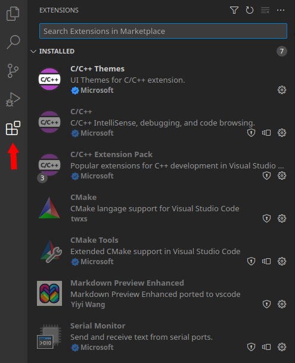

<!--
SPDX-FileCopyrightText: Copyright (C) 2023 B. Moessner
SPDX-License-Identifier: CC-BY-SA-4.0 or BSD-2-Clause
-->


# Xilinx ZYNQ7000

## Table of Contents
1. [Introduction](#introduction)

    1.1. [Supported Targets](#targets)

    1.2. [Target Comparison](#targetcomp)

    1.3. [Machine Setup](#machsetup)

2. [Hardware Setup](#hw)

    2.1. [Create a hardware platform, the FSBL and a boot image](#hw_xsa)

    2.2. [Test the boot image](#hw_boot) 


3. [Create a CMake based application](#cmake) 
 
 
    3.1. [Build RTEMS and Libbsd](#cm_a) 		
    
    3.2. [Create a CMake Toolchain File](#cm_b) 

    3.3. [Create the Application](#cm_c) 

    3.4. [Install VS Code and required extensions](#cm_d) 


4. [Xilinx QEMU](#qemu)

    4.1. [Running `xilinx-zynq-a9` on QEMU (deprecated?)](#qemu_deprecated)

    4.2. [Running machines defined by a devicetree](#qemu_hardware)

    4.3. [Debug applications running on QEMU](#qemu_software)


## 1 Introduction <a name="introduction"></a> 

This folder provides a minimal BSP (showcasing SMP and Console UART) for some of the most popular ZYNQ 7000 demo boards. In addition to that, the [Appendix](#appendix) contains some scripts and additional material to reproduce / follow this README. All work was done on Ubuntu 20.04.3 using Xilinx Vivado / Vitis / Vitis HLS 2021.2.1. If you require a more advanced method to program ZYNQ 7000 devices using OpenOCD, have a look at [this page](https://devel.rtems.org/wiki/Debugging/OpenOCD/Xilinx_Zynq).


### 1.1. Supported Targets <a name="targets"></a> 

| RTEMS BSP Name       | Compatible Board               | Product Page                                                                             |
| -------------------- | ------------------------------ | ---------------------------------------------------------------------------------------- |
| xilinx_zynq_zc702    | ZC702                          | https://www.xilinx.com/products/boards-and-kits/ek-z7-zc702-g.html                       |
| xilinx_zynq_zc706    | ZC706                          | https://www.xilinx.com/products/boards-and-kits/ek-z7-zc706-g.html                       |
| xilinx_zynq_zedboard | Zedboard                       | https://www.avnet.com/wps/portal/us/products/avnet-boards/avnet-board-families/zedboard/ |
| xilinx_zynq_picozed  | Picozed 7010, **7015**, 7020, 7030 | https://www.avnet.com/wps/portal/us/products/avnet-boards/avnet-board-families/picozed/  |
| xilinx_zynq_zybo     | **Zybo**                           | https://digilent.com/reference/programmable-logic/zybo/start                             |
| xilinx_zynq_zybo_z7  | Zybo **Z7-10**, Z7-20              | https://digilent.com/reference/programmable-logic/zybo-z7/start                          |
| xilinx_zynq_pynq     | **PYNQ Z1**, Z2                    | http://www.pynq.io/home.html |
| xilinx_zynq_microzed | MicroZed 7010, 7020                     | https://www.avnet.com/wps/portal/us/products/avnet-boards/avnet-board-families/microzed/ |                                                             |
| xilinx_zynq_a9_qemu  | **QEMU Machine xilinx-zynq-a9**    |                                                                                          |

**_NOTE:_** The author of this `README.md` has run RTEMS on the targets marked **bold**. Please update this README if you are using one of the boards that hasnt been marked yet.

**_NOTE:_** If you have an Arty Z7-10/20 you might want to compare schematic and xdc with PYNQ Z1. ;)


### 1.2. Target Comparison <a name="targetcomp"></a> 

<style>
tabled.horz {
    table-layout:fixed
}
table.horz td {
  text-align: center;
  vertical-align: middel;
  width:10%
}
table.horz th {
  text-align: right;
  background: grey;
  color: darkgrey;
  border-right: 1px solid darkgrey;
  border-bottom: 0px solid darkgrey; 
}
</style>

<table class="horz" style="width:100%">
    <tr.grey >
        <th>RTEMS BSP Name</th>
        <td>xilinx_zynq_zc702</td>
        <td>xilinx_zynq_zc706</td>
        <td>xilinx_zynq_zedboard</td>
        <td colspan="4" style="text-align: center">xilinx_zynq_picozed</td>
        <td>xilinx_zynq_zybo</td>
        <td colspan="2" style="text-align: center">xilinx_zynq_zybo_z7</td>
        <td colspan="2" style="text-align: center">xilinx_zynq_microzed</td>
        <td colspan="2" style="text-align: center">xilinx_zynq_pynq</td>
    </tr>
    <tr>
        <th>Compatible Board</th>
        <td>ZC702</td>
        <td>ZC706</td>
        <td>Zedboard</td>
        <td>PicoZed 7010 SOM C/I Grade</td>
        <td>PicoZed 7020 SOM C/I Grade</td>
        <td>PicoZed 7015 SOM I Grade</td>
        <td>PicoZed 7030 SOM I Grade</td>
        <td>Zybo</td>
        <td>Zybo Z7-10</td>
        <td>Zybo Z7-20</td>
        <td>MicoZed 7010 SOM C/I Grade</td>
        <td>MicoZed 7020 SOM C/I Grade</td>
        <td>PYNQ Z1</td>
        <td>PYNQ Z2</td>
    </tr>
    <tr>
        <th>Carrier</th>
        <td>NA</td>
        <td>NA</td>
        <td>NA</td>
        <td colspan="4" style="text-align: center">AES-PZCC-FMC-V2-G</td>
        <td>NA</td>
        <td>NA</td>
        <td>NA</td>
        <td colspan="2" style="text-align: center">various</td>
        <td>NA</td>
        <td>NA</td>
    </tr>
    <tr>
        <th>Part</th>
        <td>XC7Z020-1CLG484C</td>
        <td>XC7Z045-2FFG900C</td>
        <td>XC7Z020-1CLG484C</td>
        <td>XC7Z010-1CLG400C/I</td>
        <td>XC7Z020-1CLG400C/I</td>
        <td>XC7Z015-1SBG485I</td>
        <td>XC7Z030-1SBG485I</td>
        <td>XC7Z010-1CLG400C</td>
        <td>XC7Z010-1CLG400C</td>
        <td>XC7Z020-1CLG400C</td>
        <td>XC7Z010-1CLG400C</td>
        <td>XC7Z020-1CLG400C</td>
        <td>XC7Z020-1CLG400C</td>
        <td>XC7Z020-1CLG400C</td>
    </tr>
    <tr>
        <th>SD Card</th>
        <td colspan="14" style="text-align: center">Yes</td>
    </tr>
    <tr>
        <th>PS QSPI Flash</th>
        <td>2x16 MB</td>
        <td>16 MB</td>
        <td>32 MB</td>
        <td colspan="4" style="text-align: center">16 MB</td>
        <td>16 MB</td>
        <td colspan="2" style="text-align: center">16 MB</td>
        <td colspan="2" style="text-align: center">16 MB</td>
        <td colspan="2" style="text-align: center">16 MB</td>
    </tr>
    <tr>
        <th>PS DDR3</th>
        <td>1 GB</td>
        <td>1 GB</td>
        <td>512 MB</td>
        <td colspan="4" style="text-align: center">1 GB</td>
        <td>512 MB</td>
        <td colspan="2" style="text-align: center">1 GB</td>
        <td colspan="2" style="text-align: center">1 GB</td>
        <td colspan="2" style="text-align: center">512 MB</td>
    </tr>
    <tr>
        <th>PS Clk</th>
        <td>33.33 MHz</td>
        <td>33.33 MHz</td>
        <td>33.33 MHz</td>
        <td colspan="4" style="text-align: center">33.33 MHz</td>
        <td>50 MHz</td>
        <td colspan="2" style="text-align: center">33.33 MHz</td>
        <td colspan="2" style="text-align: center">33.33 MHz</td>
        <td colspan="2" style="text-align: center">50 MHz</td>
    </tr>
    <tr>
        <th>Console UART</th>
        <td  colspan="10" style="text-align: center">1</td>
        <td  colspan="2" style="text-align: center">0</td>
        <td  colspan="2" style="text-align: center">1</td>
    </tr>
</table>

### 1.3. Machine Setup <a name="machinesetup"></a> 

On Ubuntu 20.04, prepare the machine using:

```
sudo apt install build-essential unzip pax bison flex texinfo \
python3-dev python-is-python3 libpython2-dev libncurses5-dev zlib1g-dev \
ninja-build pkg-config libtool libpixman-1-dev default-jre  libhidapi-dev libftdi-dev libusb-1.0-0 libusb-1.0-0-dev

sudo snap install cmake
```

In addition to that, install: 

* [Xilinx 2021.2 Vivado / Vitis tools](https://www.xilinx.com/support/download/index.html/content/xilinx/en/downloadNav/vivado-design-tools/archive.html) 
* [VS Code](https://code.visualstudio.com/) or Eclipse Embedded (commented out in `1_3_0_install_tools.sh`)
* [Segger J-Link Software](https://www.segger.com/downloads/jlink/) if you plan to use J-Link 
* [Xilinx Cable Drivers](https://docs.xilinx.com/r/en-US/ug973-vivado-release-notes-install-license/Install-Cable-Drivers) if you want to use OpenOCD

The [Appendix](#appendix) contains a couple of scripts to easen the build flow. The expected folder structure in `~/demo` is:

```
.
├── app
│   ├── cmake
│   │   ├── rtems.spec.in
│   │   └── toolchain.cmake.in
│   ├── dbg
│   │   └── pynq.cfg
│   └── src
│       ├── CMakeLists.txt
│       └── main
│           ├── main.cpp
│           └── pre_main.c
├── dts
│   ├── picozed-zynq7.dtb
│   ├── picozed-zynq7.dts
│   └── zynq-7000.dtsi
├── LICENSE
├── README.md
├── scripts
│   ├── 1_3_0_install_tools.sh
│   ├── 2_1_0_build_hardware.sh
│   ├── 2_1_1_build_fsbl.sh
│   ├── 2_1_2_build_boot_file.sh
│   ├── 3_0_0_build_rtems_libbsd.sh
│   ├── 4_0_0_create_toolchain_file.sh
│   └── config
│       └── config.sh
└── vscode_extensions.png

```
Per default, the scripts will download & install all tools below `~/quick-start` (adjust this behaviour in `config.sh` if required). 

To build & install QEMU, OpenOCD, and the RTEMS tools, run:

```
blofeld@ubuntu::~/rtems_zynq_demo$ ./scripts/1_3_0_install_tools.sh 
```

## 2. Hardware Setup <a name="hw"></a> 

### 2.1. Create a hardware platform, the FSBL and a boot image <a name="hw_xsa"></a> 

RTEMS applications can be booted solely with the help of Xilinx Bootgen (i.e. Uboot is not necessarily required). Xilinx Bootgen creates a `boot.bin` file which contains the firststage bootloader (**FSBL**), the FPGA bitstream, and optionally an application. If the application is not included in the `boot.bin` file, the FSBL will enable the JTAG interface and halt operation after the FPGA is programmed. We will exploit this behaviour as downloading FSBL and Bitstream to the target device is time consuming. In addition to that, the debug scripts get more complex.

Bootgen takes in a `bif` - file which usually looks this way:

```
the_ROM_image:
{
  [bootloader] fsbl.elf
  bitstream.bit
  app.elf
}
```

To create a boot image simply run:
```
# SD Card boot.bin
bootgen -arch zynq -image my.bif -w on -o boot.bin

# Some programmers expect mcs
bootgen -arch zynq -image my.bi -w on -o boot.mcs
```

The reference design, firststage bootloader (**FSBL**) and boot image (**boot.bin / boot.mcs**) can be created with:

```
blofeld@ubuntu:~/rtems_zynq_demo$ ./2_1_0_build_hardware.sh -b <board_name>
```

The `board_name` can be one of:
* Pynq-Z1, -Z2
* Picozed-7010, -7015, -7020, -7030
* Microzed-7010, -7020
* Zybo, -Z7-10, -Z7-20

The **.xsa**, **.bin**, **.bit** , **.mcs** files for the board will be stored in `${TOP_INSTALL_DIR}/hw/<board_name>` (`${TOP_INSTALL_DIR}` can be set in `config.sh`). Internally, the script will call
```
2_1_1_build_fsbl -x <full_path_to_xsa_file> -b <bit_file_name> -o <full_path_to_output_folder>
```
to generate the bootloader and 
```
2_1_2_build_boot_file -b <bit_file> -f <fsbl_file> -o <full_path_to_output_folder>
```
to create a boot image which only contains the bitstream and the bootloader. If you want to include your application in the boot image, you can can call `3_1_2_build_boot_file` using `-a <app_file>`. 

```
2_1_2_build_boot_file -b <bit_file> -f <fsbl_file> -a <app_file> -o <full_path_to_output_folder>
```


### 2.2. Test the boot image <a name="hw_boot"></a> 

Copy the `boot.bin` to an SD card and plug it into your board. Switch the board to SD card boot mode and connect a terminal to the USB UART (115k2, 8N1). When you reset the board you should observe some messages from the FSBL telling you that it first programs the FPGA and then opens up the JTAG port before it halts.

Example of an FSBL boot log:

```
Xilinx First Stage Boot Loader Release 2021.2 Nov  1 2023-20:58:14
Devcfg driver initialized 
Silicon Version 3.1
Boot mode is SD
SD: rc= 0SD Init Done 
Flash Base Address: 0xE0100000
Reboot status register: 0x60600000
Multiboot Register: 0x0000C000
Image Start Address: 0x00000000
Partition Header Offset:0x00000C80
Partition Count: 2
Partition Number: 1
Header Dump
Image Word Len: 0x000F6EC0
Data Word Len: 0x000F6EC0
Partition Word Len:0x000F6EC0
Load Addr: 0x00000000
Exec Addr: 0x00000000
Partition Start: 0x000065D0
Partition Attr: 0x00000020
Partition Checksum Offset: 0x00000000
Section Count: 0x00000001
Checksum: 0xFFD14B7E
Bitstream
In FsblHookBeforeBitstreamDload function 
PCAP:StatusReg = 0x40000A30
PCAP:device ready
PCAP:Clear done
Level Shifter Value = 0xA 
Devcfg Status register = 0x40000A30 
PCAP:Fabric is Initialized done
PCAP register dump:
PCAP CTRL 0xF8007000: 0x4C00E07F
PCAP LOCK 0xF8007004: 0x0000001A
PCAP CONFIG 0xF8007008: 0x00000508
PCAP ISR 0xF800700C: 0x0802000B
PCAP IMR 0xF8007010: 0xFFFFFFFF
PCAP STATUS 0xF8007014: 0x00006A30
PCAP DMA SRC ADDR 0xF8007018: 0x00100001
PCAP DMA DEST ADDR 0xF800701C: 0xFFFFFFFF
PCAP DMA SRC LEN 0xF8007020: 0x000F6EC0
PCAP DMA DEST LEN 0xF8007024: 0x000F6EC0
PCAP ROM SHADOW CTRL 0xF8007028: 0xFFFFFFFF
PCAP MBOOT 0xF800702C: 0x0000C000
PCAP SW ID 0xF8007030: 0x00000000
PCAP UNLOCK 0xF8007034: 0x757BDF0D
PCAP MCTRL 0xF8007080: 0x30800100
DMA Done !
FPGA Done ! In FsblHookAfterBitstreamDload function 
Handoff Address: 0x00000000
In FsblHookBeforeHandoff function 
No Execution Address JTAG handoff 
```

## 3. Create a CMake based application <a name="cmake"></a> 

### 3.1. Build RTEMS and Libbsd <a name="cm_a"></a> 

Build and install RTEMS / libbsd by running the following script:


```
# Showcase OpenOCD debug session
blofeld@ubuntu:~/rtems_zynq_demo$ ./scripts/3_1_0_build_rtems_libbsd.sh -b xillinx_zynq_pynq

# Showcase QEMU and Segger J-Link debug session
blofeld@ubuntu:~/rtems_zynq_demo$ ./scripts/3_1_0_build_rtems_libbsd.sh -b xillinx_zynq_picozed
```

### 3.2. Create a CMake Toolchain File <a name="cm_b"></a> 

There are a few approaches to RTEMS + CMake. For example:

* See https://github.com/nasa/PSP/blob/main/cmake/Modules/Platform/RTEMS.cmake for extending CMake
* See https://github.com/robamu-org/rtems-cmake to extend RTEMS with modern CMake

Both of them have their pro/con and could even be combined. However, 

* a [CMake Toolchainfile](https://cmake.org/cmake/help/book/mastering-cmake/chapter/Cross%20Compiling%20With%20CMake.html) is required in either way 
* having modern CMake mechanisms availale only pays off if the CMakeLists of the libraries one puts on top of libbsd can be modified (not the case on my side)

This demo will use only use a toolchain file, which can be generated by running:

```
# Showcase OpenOCD debug session
blofeld@ubuntu:~/rtems_zynq_demo$ ./scripts/3_2_1_create_toolchain_file.sh -b xillinx_zynq_pynq

# Showcase QEMU and Segger J-Link debug session
blofeld@ubuntu:~/rtems_zynq_demo$ ./scripts/3_2_1_create_toolchain_file.sh -b xillinx_zynq_picozed
```

The toolchain file sets up the compiler paths and the initial flags. The example avoids using `-qrtems` by always using a gcc spec file. 
In addition to that, the executable linker flags are set so that each exectuable will link to a 'pre_main.o'. This is to make the unit tests of higher level libraries, which one might want to stack on libbsd, can be build without modifications to build scripts of this libraries. Guess in RTEMS jargon the `pre_main` file is often called `init`. The executable format is changed to `elf` as the J-Link software does not accept `exe`.


### 3.3. Create the Application <a name="cm_c"></a> 

The application can be found in the `app` folder an is componsed of three parts:

* `main.cpp` simple "Hello World"
* `pre_main.c` RTEMS initalization and jump to main
* `CMakeLists.txt` the CMake build script

Test the build:

```
blofeld@ubuntu:~/rtems_zynq_demo/$ cd app
blofeld@ubuntu:~/rtems_zynq_demo/app/$ mkdir build && cd build

# Run CMake configure step
blofeld@ubuntu:~/rtems_zynq_demo/app/build$ cmake -G"Ninja" -DCMAKE_TOOLCHAIN_FILE=~/quick-start/install/sw/xilinx_zynq_pynq/cmake/toolchain.cmake -DCMAKE_BUILD_TYPE=Debug ../src/

-- The C compiler identification is GNU 12.3.1
-- The CXX compiler identification is GNU 12.3.1
-- Detecting C compiler ABI info
-- Detecting C compiler ABI info - done
-- Check for working C compiler: /home/blofeld/quick-start/install/tools/toolchain/bin/arm-rtems6-gcc - skipped
-- Detecting C compile features
-- Detecting C compile features - done
-- Detecting CXX compiler ABI info
-- Detecting CXX compiler ABI info - done
-- Check for working CXX compiler: /home/blofeld/quick-start/install/tools/toolchain/bin/arm-rtems6-g++ - skipped
-- Detecting CXX compile features
-- Detecting CXX compile features - done
-- Configuring done (0.4s)
-- Generating done (0.0s)
-- Build files have been written to: /home/blofeld/rtems_zynq_demo/app/build

# Run CMake build
blofeld@ubuntu:~/rtems_zynq_demo/app/$ cmake --build .

[3/3] Linking CXX executable ZynqDemo.elf
Memory region         Used Size  Region Size  %age Used
       RAM_INT_0:          0 GB       192 KB      0.00%
       RAM_INT_1:          0 GB      65024 B      0.00%
         RAM_MMU:          0 GB        16 KB      0.00%
             RAM:     522224 KB    522224 KB    100.00%
         NOCACHE:          1 MB         1 MB    100.00%
UNEXPECTED_SECTIONS:          0 GB         0 GB

```

The CMake build will create three binaries:
1. `ZynqDemo.exe` - file contains code and debug symbols
2. `ZynqDemo.dbg` - file contains the debug symbols but no application code
3. `ZynqDemo.elf` - file contains application code but not debug symbols


### 3.4. Install VS Code and required extensions <a name="cm_d"></a> 

VS Code can be installed from [here](https://code.visualstudio.com/download). Start VS Code and install the following extensions:




Prepare the VS Code Workspace by running:

```
blofeld@ubuntu:~/rtems_zynq_demo$ ./scripts/3_4_0_create_vs_code_folder.sh  -b xilinx_zynq_pynq
```

The script will create the folder `.vscode` in the `app` folder and create five files:

1. `tasks.json` - contains a task to start QEMU. This task will be started when a QEMU debug session is started
2. `settings.json` - CMake minimal configuration, source dir, build dir and Generator to use
3. `launch.json` - the debug launch configurations for QEMU and OpenOCD
4. `cmake-kits.json` - VS Code introduces the concept of kits to define toolchains. In this kit we simply define a kit called RTEMS and specify the toolchain file
5. `c_cpp_properties.json` - some standard configuration for working with C/C++ (i.e. make intellisense work)

Open CMake and open the folder `app`. 
* If asked, do not agree to hide the activiybar
* If required, Ctrl + Shift + P => type "Kit" => Select a kit => use RTEMS
* Try to build the project by clicking on "build" in the lower option bar


## 4. Xilinx QEMU <a name="qemu"></a> 


### 4.1. Running `xilinx-zynq-a9` on QEMU (deprecated?) <a name="qemu_deprecated"></a> 

The machine `xilinx-zynq-a9` is only a single core without caches. It seems to have become deprecated as no Xilinx documentation is mentioning it anymore. However, one can still run ticker as it was described in the previous README in this folder:

```
~/quick-start/install/qemu/bin/qemu-system-aarch64 -no-reboot -serial null -serial mon:stdio -net none \
-nographic -M xilinx-zynq-a9 -m 256M -kernel ticker.exe

qemu-system-arm: warning: nic cadence_gem.0 has no peer
qemu-system-arm: warning: nic cadence_gem.1 has no peer


*** BEGIN OF TEST CLOCK TICK ***
*** TEST VERSION: 6.0.0.bc8e39f8ac4bebd97388522e38978b7382dc74a7
*** TEST STATE: EXPECTED_PASS
*** TEST BUILD: RTEMS_POSIX_API
*** TEST TOOLS: 12.3.1 20231012 (RTEMS 6, RSB 633023de6517998ee3b84e7ed172b1c5f2bf502b, Newlib fbc5496)
TA1  - rtems_clock_get_tod - 09:00:00   12/31/1988
TA2  - rtems_clock_get_tod - 09:00:00   12/31/1988
TA3  - rtems_clock_get_tod - 09:00:00   12/31/1988
TA1  - rtems_clock_get_tod - 09:00:04   12/31/1988
TA2  - rtems_clock_get_tod - 09:00:09   12/31/1988
TA1  - rtems_clock_get_tod - 09:00:09   12/31/1988
TA3  - rtems_clock_get_tod - 09:00:14   12/31/1988
TA1  - rtems_clock_get_tod - 09:00:14   12/31/1988
TA2  - rtems_clock_get_tod - 09:00:19   12/31/1988
TA1  - rtems_clock_get_tod - 09:00:19   12/31/1988
TA1  - rtems_clock_get_tod - 09:00:24   12/31/1988
TA3  - rtems_clock_get_tod - 09:00:29   12/31/1988
TA2  - rtems_clock_get_tod - 09:00:29   12/31/1988
TA1  - rtems_clock_get_tod - 09:00:29   12/31/1988
TA1  - rtems_clock_get_tod - 09:00:34   12/31/1988

*** END OF TEST CLOCK TICK ***


[ RTEMS shutdown ]
RTEMS version: 6.0.0.bc8e39f8ac4bebd97388522e38978b7382dc74a7
RTEMS tools: 12.3.1 20231012 (RTEMS 6, RSB 633023de6517998ee3b84e7ed172b1c5f2bf502b, Newlib fbc5496)
executing thread ID: 0x0a010003
executing thread name: TA2 
```
**_NOTE:_** To shutdown a QEMU machine use `CTRL + A`, release the keys and hit `X`.

### 4.2. Running machines defined by a devicetree <a name="qemu_hardware"></a> 

Xilinx proposes to use the machine `arm-generic-fdt-7series` ([LINK](https://xilinx-wiki.atlassian.net/wiki/spaces/A/pages/821854273/Running+Bare+Metal+Applications+on+QEMU#RunningBareMetalApplicationsonQEMU-Runningabare-metalapplicationonZynq7000)). This virtual machine is described by a devicetree which can be used to model the hardware of a concrete board. 

A devicetree example for the Picozed board has been added (see subfolder `dts`). Some notes on that:
* The skelton `zynq-7000.dtsi` has been modified to make QEMU load a model of the PL310 cache controller. It may sound strange, but `compatible = "arm,pl310-cache";` must be replaced by `compatible = "arm,l2x0";` as the original setting only loads a dummy and you will end up with a fatal error (`ARM_FATAL_L2C_310_UNEXPECTED_ID`) as soon as RTEMS has been configured to use I/D caches.
* The devicetree specifies two cores. Therefore, `RTEMS_SMP` needs to be enabled when building RTEMS


The devicetree blob can be build using:

```
blofeld@ubuntu:~/demo$ mkdir ~/quick-start/install/dtb
blofeld@ubuntu:~/demo$ ~/quick-start/install/toolchain/bin/dtc  -I dts -O dtb -o ~/quick-start/install/dtb/picozed-zynq7.dtb dts/picozed-zynq7.dts
```

Now run the machine with:
```
~/qemu_install/bin/qemu-system-aarch64 -M arm-generic-fdt-7series -serial /dev/null -serial mon:stdio -display none \
-m 1024M -kernel ticker.exe -dtb ~/quick-start/install/dtb/picozed-zynq7.dtb


*** BEGIN OF TEST CLOCK TICK ***
*** TEST VERSION: 6.0.0.bc8e39f8ac4bebd97388522e38978b7382dc74a7
*** TEST STATE: EXPECTED_PASS
*** TEST BUILD: RTEMS_POSIX_API RTEMS_SMP
*** TEST TOOLS: 12.3.1 20231012 (RTEMS 6, RSB 633023de6517998ee3b84e7ed172b1c5f2bf502b, Newlib fbc5496)
TA1  - rtems_clock_get_tod - 09:00:00   12/31/1988
TA2  - rtems_clock_get_tod - 09:00:00   12/31/1988
TA3  - rtems_clock_get_tod - 09:00:00   12/31/1988
TA1  - rtems_clock_get_tod - 09:00:04   12/31/1988
TA2  - rtems_clock_get_tod - 09:00:09   12/31/1988
TA1  - rtems_clock_get_tod - 09:00:09   12/31/1988
TA3  - rtems_clock_get_tod - 09:00:14   12/31/1988
TA1  - rtems_clock_get_tod - 09:00:14   12/31/1988
TA2  - rtems_clock_get_tod - 09:00:19   12/31/1988
TA1  - rtems_clock_get_tod - 09:00:19   12/31/1988
TA1  - rtems_clock_get_tod - 09:00:24   12/31/1988
TA3  - rtems_clock_get_tod - 09:00:29   12/31/1988
TA2  - rtems_clock_get_tod - 09:00:29   12/31/1988
TA1  - rtems_clock_get_tod - 09:00:29   12/31/1988
TA1  - rtems_clock_get_tod - 09:00:34   12/31/1988

*** END OF TEST CLOCK TICK ***


[ RTEMS shutdown ]
CPU: 0
RTEMS version: 6.0.0.bc8e39f8ac4bebd97388522e38978b7382dc74a7
RTEMS tools: 12.3.1 20231012 (RTEMS 6, RSB 633023de6517998ee3b84e7ed172b1c5f2bf502b, Newlib fbc5496)
executing thread ID: 0x0a010003
executing thread name: TA2 
```
**_NOTE:_** To shutdown a QEMU machine use `CTRL + A`, release the keys and hit `X`.


## 3.3 Debug


Segger J-Link works fine (https://www.segger.com/products/debug-probes/j-link/). Segger also provides an adpater for the Xilinx Debug Header (https://www.segger.com/products/debug-probes/j-link/accessories/adapters/xilinx-adapter/).


